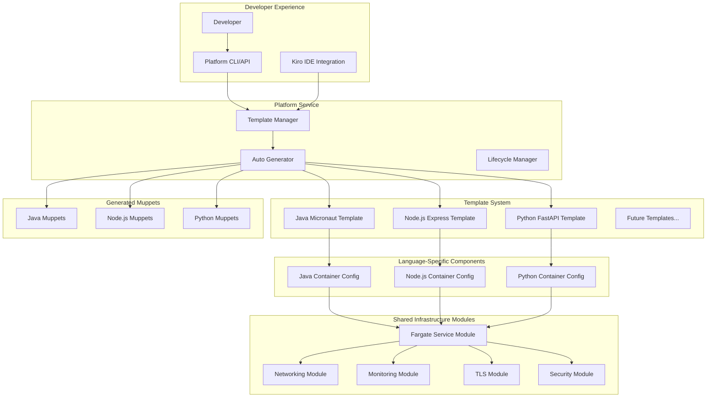

# Multi-Language Template Support Design Document

## Overview

This document outlines the design for extending the Muppet Platform to support Node.js and Python templates alongside the existing Java Micronaut template. The design leverages the platform's existing "Simple by Default, Extensible by Choice" architecture to maximize infrastructure reuse while providing language-specific optimizations.

The solution maintains the platform's core principles:
- **Zero-Config Experience**: Developers get production-ready applications with minimal configuration
- **Infrastructure Reuse**: Maximum reuse of existing OpenTofu modules and platform services
- **Consistent Developer Experience**: Same workflows, tooling, and deployment patterns across all languages
- **Performance Optimization**: Language-specific optimizations for containers, builds, and runtime environments

## Architecture

### High-Level Architecture



### Template Architecture

The template system follows a layered architecture that separates concerns:

1. **Application Layer**: Language-specific source code, tests, and build configuration
2. **Infrastructure Layer**: Shared OpenTofu modules with language-specific container configuration
3. **CI/CD Layer**: Shared workflow structure with language-specific build steps
4. **Development Layer**: Shared tooling (scripts, Makefile) with language-specific implementations

## Components and Interfaces

### Enhanced Template Manager

The existing `TemplateManager` will be enhanced to support multiple languages while maintaining backward compatibility:

```python
class TemplateManager:
    """Enhanced to support multiple programming languages."""
    
    def discover_templates(self) -> List[Template]:
        """Discover all language templates in the templates directory."""
        # Enhanced to support java-micronaut, node-express, python-fastapi
        
    def validate_template(self, name: str) -> bool:
        """Validate template with language-specific validation rules."""
        # Enhanced with language-specific validation
        
    def generate_code(self, context: GenerationContext) -> Path:
        """Generate code with language-specific processing."""
        # Enhanced to handle different language requirements
```

**Language-Specific Validation Rules:**

```python
class LanguageValidator:
    """Language-specific template validation."""
    
    def validate_java_template(self, template_path: Path) -> List[str]:
        """Validate Java Micronaut template structure."""
        errors = []
        
        # Validate Java 21 LTS requirement
        if not self._check_java_version(template_path, "21"):
            errors.append("Java templates must use Java 21 LTS")
            
        # Validate Gradle configuration
        if not (template_path / "build.gradle.template").exists():
            errors.append("Missing build.gradle.template")
            
        return errors
    
    def validate_nodejs_template(self, template_path: Path) -> List[str]:
        """Validate Node.js Express template structure."""
        errors = []
        
        # Validate Node.js 20 LTS requirement
        if not self._check_nodejs_version(template_path, "20"):
            errors.append("Node.js templates must use Node.js 20 LTS")
            
        # Validate package.json and TypeScript config
        required_files = ["package.json.template", "tsconfig.json.template"]
        for file in required_files:
            if not (template_path / file).exists():
                errors.append(f"Missing {file}")
                
        return errors
    
    def validate_python_template(self, template_path: Path) -> List[str]:
        """Validate Python FastAPI template structure."""
        errors = []
        
        # Validate Python 3.11 requirement
        if not self._check_python_version(template_path, "3.11"):
            errors.append("Python templates must use Python 3.11")
            
        # Validate requirements.txt and FastAPI setup
        required_files = ["requirements.txt.template", "pyproject.toml.template"]
        for file in required_files:
            if not (template_path / file).exists():
                errors.append(f"Missing {file}")
                
        return errors
```

### Language-Specific Steering Documents

The platform will provide comprehensive but practical steering documents for each language:

```python
class SteeringDocumentGenerator:
    """Generates language-specific steering documents with best practices."""
    
    def generate_language_steering(self, language: str, muppet_name: str, output_path: Path) -> None:
        """Generate language-specific steering documents."""
        
        steering_dir = output_path / ".kiro" / "steering"
        steering_dir.mkdir(parents=True, exist_ok=True)
        
        # Generate shared steering (applies to all languages)
        self._generate_shared_steering(steering_dir)
        
        # Generate language-specific steering
        if language == "java":
            self._generate_java_steering(steering_dir, muppet_name)
        elif language == "javascript":
            self._generate_nodejs_steering(steering_dir, muppet_name)
        elif language == "python":
            self._generate_python_steering(steering_dir, muppet_name)
    
    def _generate_nodejs_steering(self, steering_dir: Path, muppet_name: str) -> None:
        """Generate Node.js/Express.js specific steering documents."""
        
        # Express.js patterns and best practices
        express_patterns = self._create_express_patterns_doc(muppet_name)
        (steering_dir / "express-patterns.md").write_text(express_patterns)
        
        # TypeScript best practices
        typescript_guide = self._create_typescript_guide_doc()
        (steering_dir / "typescript-best-practices.md").write_text(typescript_guide)
        
        # Node.js performance optimization
        performance_guide = self._create_nodejs_performance_doc()
        (steering_dir / "nodejs-performance.md").write_text(performance_guide)
        
        # Testing patterns with Jest
        testing_guide = self._create_nodejs_testing_doc()
        (steering_dir / "testing-patterns.md").write_text(testing_guide)
    
    def _generate_python_steering(self, steering_dir: Path, muppet_name: str) -> None:
        """Generate Python/FastAPI specific steering documents."""
        
        # FastAPI patterns and best practices
        fastapi_patterns = self._create_fastapi_patterns_doc(muppet_name)
        (steering_dir / "fastapi-patterns.md").write_text(fastapi_patterns)
        
        # Pydantic usage and validation
        pydantic_guide = self._create_pydantic_guide_doc()
        (steering_dir / "pydantic-best-practices.md").write_text(pydantic_guide)
        
        # Python performance optimization
        performance_guide = self._create_python_performance_doc()
        (steering_dir / "python-performance.md").write_text(performance_guide)
        
        # Testing patterns with pytest
        testing_guide = self._create_python_testing_doc()
        (steering_dir / "testing-patterns.md").write_text(testing_guide)
    
    def _generate_java_steering(self, steering_dir: Path, muppet_name: str) -> None:
        """Generate Java/Micronaut specific steering documents."""
        
        # Enhanced Micronaut patterns (building on existing)
        micronaut_patterns = self._create_enhanced_micronaut_patterns_doc(muppet_name)
        (steering_dir / "micronaut-patterns.md").write_text(micronaut_patterns)
        
        # Java 21 LTS features and best practices
        java21_guide = self._create_java21_features_doc()
        (steering_dir / "java21-best-practices.md").write_text(java21_guide)
        
        # JVM optimization for containers
        jvm_guide = self._create_jvm_optimization_doc()
        (steering_dir / "jvm-optimization.md").write_text(jvm_guide)
    
    def _generate_shared_steering(self, steering_dir: Path) -> None:
        """Generate shared steering documents that apply to all languages."""
        
        shared_dir = steering_dir / "shared"
        shared_dir.mkdir(parents=True, exist_ok=True)
        
        # These are symlinked or copied from platform shared steering
        shared_docs = [
            "security.md",           # Security best practices
            "logging.md",            # Structured logging standards
            "testing.md",            # General testing principles
            "performance.md",        # Performance monitoring
            "infrastructure.md",     # Infrastructure patterns
            "http-responses.md",     # API response standards
            "monitoring.md",         # Observability patterns
            "deployment.md"          # Deployment best practices
        ]
        
        for doc in shared_docs:
            # Create placeholder that references shared platform docs
            placeholder = f"""# {doc.replace('.md', '').replace('-', ' ').title()}

This document is automatically synchronized from the platform's shared steering documentation.

For the latest version, see: `../../../steering-docs/shared/{doc}`

The shared steering documents provide platform-wide standards that apply to all muppets regardless of programming language.
"""
            (shared_dir / doc).write_text(placeholder)

class SteeringDocumentTemplates:
    """Templates for language-specific steering documents."""
    
    @staticmethod
    def create_express_patterns_template(muppet_name: str) -> str:
        """Create Express.js patterns steering document."""
        return f"""# Express.js Patterns and Best Practices for {muppet_name}

## Overview

This document provides practical guidance for developing Express.js applications within the Muppet Platform. These patterns are sensible defaults that promote maintainability and performance without being overly restrictive.

## Application Structure

### Recommended Directory Structure
```
src/
├── controllers/     # Route handlers and business logic
├── middleware/      # Custom middleware functions
├── models/          # Data models and validation
├── services/        # Business logic and external integrations
├── utils/           # Utility functions and helpers
├── types/           # TypeScript type definitions
└── app.ts           # Express application setup
```

### Controller Patterns

**✅ Recommended: Thin Controllers**
```typescript
// controllers/userController.ts
export const getUser = async (req: Request, res: Response) => {{
  try {{
    const user = await userService.findById(req.params.id);
    res.json({{ success: true, data: user }});
  }} catch (error) {{
    res.status(404).json({{ success: false, error: 'User not found' }});
  }}
}};
```

**❌ Avoid: Fat Controllers**
```typescript
// Don't put business logic directly in controllers
export const getUser = async (req: Request, res: Response) => {{
  // Avoid database queries, complex validation, etc. here
}};
```

## Middleware Patterns

### Error Handling Middleware
```typescript
// middleware/errorHandler.ts
export const errorHandler = (err: Error, req: Request, res: Response, next: NextFunction) => {{
  logger.error('Request error', {{ error: err.message, path: req.path }});
  
  if (err instanceof ValidationError) {{
    return res.status(400).json({{ success: false, error: err.message }});
  }}
  
  res.status(500).json({{ success: false, error: 'Internal server error' }});
}};
```

### Request Validation Middleware
```typescript
// middleware/validation.ts
import {{ body, validationResult }} from 'express-validator';

export const validateUser = [
  body('email').isEmail().normalizeEmail(),
  body('name').trim().isLength({{ min: 1, max: 100 }}),
  (req: Request, res: Response, next: NextFunction) => {{
    const errors = validationResult(req);
    if (!errors.isEmpty()) {{
      return res.status(400).json({{ success: false, errors: errors.array() }});
    }}
    next();
  }}
];
```

## Service Layer Patterns

### Dependency Injection
```typescript
// services/userService.ts
export class UserService {{
  constructor(
    private userRepository: UserRepository,
    private emailService: EmailService
  ) {{}}
  
  async createUser(userData: CreateUserRequest): Promise<User> {{
    const user = await this.userRepository.create(userData);
    await this.emailService.sendWelcomeEmail(user.email);
    return user;
  }}
}}
```

## Testing Patterns

### Controller Testing
```typescript
// tests/controllers/userController.test.ts
describe('UserController', () => {{
  let mockUserService: jest.Mocked<UserService>;
  
  beforeEach(() => {{
    mockUserService = {{
      findById: jest.fn(),
      create: jest.fn(),
    }} as any;
  }});
  
  it('should return user when found', async () => {{
    const mockUser = {{ id: '1', name: 'John Doe' }};
    mockUserService.findById.mockResolvedValue(mockUser);
    
    const req = {{ params: {{ id: '1' }} }} as any;
    const res = {{ json: jest.fn(), status: jest.fn().mockReturnThis() }} as any;
    
    await getUser(req, res);
    
    expect(res.json).toHaveBeenCalledWith({{ success: true, data: mockUser }});
  }});
}});
```

## Performance Considerations

### Response Caching
```typescript
// middleware/cache.ts
import {{ createHash }} from 'crypto';

export const cacheMiddleware = (ttl: number = 300) => {{
  const cache = new Map<string, {{ data: any; expires: number }}>();
  
  return (req: Request, res: Response, next: NextFunction) => {{
    const key = createHash('md5').update(req.originalUrl).digest('hex');
    const cached = cache.get(key);
    
    if (cached && cached.expires > Date.now()) {{
      return res.json(cached.data);
    }}
    
    const originalJson = res.json;
    res.json = function(data: any) {{
      cache.set(key, {{ data, expires: Date.now() + ttl * 1000 }});
      return originalJson.call(this, data);
    }};
    
    next();
  }};
}};
```

### Database Connection Pooling
```typescript
// config/database.ts
export const dbConfig = {{
  host: process.env.DB_HOST,
  port: parseInt(process.env.DB_PORT || '5432'),
  database: process.env.DB_NAME,
  username: process.env.DB_USER,
  password: process.env.DB_PASSWORD,
  pool: {{
    min: 2,
    max: 10,
    idle: 10000,
    acquire: 60000,
  }}
}};
```

## Security Best Practices

### Input Sanitization
```typescript
import helmet from 'helmet';
import rateLimit from 'express-rate-limit';

// Security middleware
app.use(helmet());
app.use(rateLimit({{
  windowMs: 15 * 60 * 1000, // 15 minutes
  max: 100 // limit each IP to 100 requests per windowMs
}}));
```

### Environment Variables
```typescript
// config/env.ts
import {{ z }} from 'zod';

const envSchema = z.object({{
  NODE_ENV: z.enum(['development', 'staging', 'production']),
  PORT: z.string().transform(Number),
  DATABASE_URL: z.string().url(),
  JWT_SECRET: z.string().min(32),
}});

export const env = envSchema.parse(process.env);
```

## Monitoring and Logging

### Structured Logging
```typescript
// utils/logger.ts
import winston from 'winston';

export const logger = winston.createLogger({{
  level: process.env.LOG_LEVEL || 'info',
  format: winston.format.combine(
    winston.format.timestamp(),
    winston.format.errors({{ stack: true }}),
    winston.format.json()
  ),
  transports: [
    new winston.transports.Console(),
  ],
}});
```

### Request Logging
```typescript
// middleware/requestLogger.ts
export const requestLogger = (req: Request, res: Response, next: NextFunction) => {{
  const start = Date.now();
  
  res.on('finish', () => {{
    const duration = Date.now() - start;
    logger.info('Request completed', {{
      method: req.method,
      path: req.path,
      statusCode: res.statusCode,
      duration,
      userAgent: req.get('User-Agent'),
    }});
  }});
  
  next();
}};
```

## Guidelines Philosophy

These patterns are **guidelines, not rigid rules**. They provide:

- **Consistency**: Common patterns across the team
- **Maintainability**: Code that's easy to understand and modify
- **Performance**: Efficient patterns for production use
- **Security**: Safe defaults for common scenarios

**When to deviate**: These patterns work for most scenarios, but feel free to adapt them when:
- Your specific use case requires different approaches
- You have performance requirements that need optimization
- You're integrating with external systems that require different patterns

**Remember**: The goal is productive, maintainable code that serves your users well.
"""

    @staticmethod
    def create_typescript_guide_template() -> str:
        """Create TypeScript best practices steering document."""
        return """# TypeScript Best Practices for Muppet Platform

## Overview

This guide provides practical TypeScript patterns for Express.js applications. These recommendations balance type safety with development velocity.

## Type Definitions

### API Request/Response Types
```typescript
// types/api.ts
export interface ApiResponse<T = any> {
  success: boolean;
  data?: T;
  error?: string;
  errors?: ValidationError[];
}

export interface PaginatedResponse<T> extends ApiResponse<T[]> {
  pagination: {
    page: number;
    limit: number;
    total: number;
    totalPages: number;
  };
}
```

### Domain Models
```typescript
// types/user.ts
export interface User {
  id: string;
  email: string;
  name: string;
  createdAt: Date;
  updatedAt: Date;
}

export interface CreateUserRequest {
  email: string;
  name: string;
  password: string;
}

export type UpdateUserRequest = Partial<Pick<User, 'name' | 'email'>>;
```

## Express.js with TypeScript

### Typed Request Handlers
```typescript
// types/express.ts
import { Request, Response } from 'express';

export interface TypedRequest<T = any> extends Request {
  body: T;
}

export interface TypedResponse<T = any> extends Response {
  json(body: ApiResponse<T>): this;
}

// Usage in controllers
export const createUser = async (
  req: TypedRequest<CreateUserRequest>,
  res: TypedResponse<User>
) => {
  const userData = req.body; // Fully typed
  const user = await userService.create(userData);
  res.json({ success: true, data: user });
};
```

### Middleware Typing
```typescript
// middleware/auth.ts
export interface AuthenticatedRequest extends Request {
  user: User;
}

export const authenticate = async (
  req: Request,
  res: Response,
  next: NextFunction
): Promise<void> => {
  try {
    const token = req.headers.authorization?.replace('Bearer ', '');
    const user = await authService.validateToken(token);
    (req as AuthenticatedRequest).user = user;
    next();
  } catch (error) {
    res.status(401).json({ success: false, error: 'Unauthorized' });
  }
};
```

## Configuration and Environment

### Type-Safe Environment Variables
```typescript
// config/env.ts
import { z } from 'zod';

const envSchema = z.object({
  NODE_ENV: z.enum(['development', 'staging', 'production']).default('development'),
  PORT: z.string().transform(Number).default('3000'),
  DATABASE_URL: z.string().url(),
  JWT_SECRET: z.string().min(32),
  LOG_LEVEL: z.enum(['error', 'warn', 'info', 'debug']).default('info'),
});

export type Environment = z.infer<typeof envSchema>;
export const env = envSchema.parse(process.env);
```

## Error Handling

### Custom Error Types
```typescript
// types/errors.ts
export class ValidationError extends Error {
  constructor(
    message: string,
    public field: string,
    public code: string = 'VALIDATION_ERROR'
  ) {
    super(message);
    this.name = 'ValidationError';
  }
}

export class NotFoundError extends Error {
  constructor(resource: string, id: string) {
    super(`${resource} with id ${id} not found`);
    this.name = 'NotFoundError';
  }
}
```

### Type-Safe Error Handler
```typescript
// middleware/errorHandler.ts
export const errorHandler = (
  err: Error,
  req: Request,
  res: Response,
  next: NextFunction
): void => {
  if (err instanceof ValidationError) {
    res.status(400).json({
      success: false,
      error: err.message,
      code: err.code,
      field: err.field,
    });
    return;
  }

  if (err instanceof NotFoundError) {
    res.status(404).json({
      success: false,
      error: err.message,
    });
    return;
  }

  // Generic error
  res.status(500).json({
    success: false,
    error: 'Internal server error',
  });
};
```

## Testing with TypeScript

### Test Utilities
```typescript
// tests/utils/testHelpers.ts
export const createMockRequest = <T = any>(body?: T): TypedRequest<T> => ({
  body,
  params: {},
  query: {},
  headers: {},
} as TypedRequest<T>);

export const createMockResponse = (): TypedResponse => {
  const res = {} as TypedResponse;
  res.status = jest.fn().mockReturnValue(res);
  res.json = jest.fn().mockReturnValue(res);
  return res;
};
```

### Service Testing
```typescript
// tests/services/userService.test.ts
describe('UserService', () => {
  let userService: UserService;
  let mockRepository: jest.Mocked<UserRepository>;

  beforeEach(() => {
    mockRepository = {
      findById: jest.fn(),
      create: jest.fn(),
      update: jest.fn(),
      delete: jest.fn(),
    };
    userService = new UserService(mockRepository);
  });

  it('should create user with valid data', async () => {
    const userData: CreateUserRequest = {
      email: 'test@example.com',
      name: 'Test User',
      password: 'securepassword',
    };

    const expectedUser: User = {
      id: '1',
      email: userData.email,
      name: userData.name,
      createdAt: new Date(),
      updatedAt: new Date(),
    };

    mockRepository.create.mockResolvedValue(expectedUser);

    const result = await userService.create(userData);

    expect(result).toEqual(expectedUser);
    expect(mockRepository.create).toHaveBeenCalledWith(userData);
  });
});
```

## Performance Considerations

### Type-Only Imports
```typescript
// Use type-only imports when possible
import type { User } from '../types/user';
import type { ApiResponse } from '../types/api';

// Regular imports for runtime values
import { userService } from '../services/userService';
```

### Utility Types
```typescript
// types/utils.ts
export type Optional<T, K extends keyof T> = Omit<T, K> & Partial<Pick<T, K>>;
export type RequiredFields<T, K extends keyof T> = T & Required<Pick<T, K>>;

// Usage
type CreateUserData = Optional<User, 'id' | 'createdAt' | 'updatedAt'>;
type UserWithRequiredEmail = RequiredFields<Partial<User>, 'email'>;
```

## Configuration Guidelines

### TSConfig Recommendations
```json
// tsconfig.json
{
  "compilerOptions": {
    "target": "ES2022",
    "module": "commonjs",
    "lib": ["ES2022"],
    "outDir": "./dist",
    "rootDir": "./src",
    "strict": true,
    "esModuleInterop": true,
    "skipLibCheck": true,
    "forceConsistentCasingInFileNames": true,
    "resolveJsonModule": true,
    "declaration": true,
    "declarationMap": true,
    "sourceMap": true,
    "removeComments": false,
    "noImplicitReturns": true,
    "noFallthroughCasesInSwitch": true,
    "noUncheckedIndexedAccess": true,
    "exactOptionalPropertyTypes": true
  },
  "include": ["src/**/*"],
  "exclude": ["node_modules", "dist", "tests"]
}
```

## Guidelines Philosophy

These TypeScript patterns provide:

- **Type Safety**: Catch errors at compile time
- **Developer Experience**: Better IDE support and autocomplete
- **Maintainability**: Self-documenting code through types
- **Gradual Adoption**: Start simple, add complexity as needed

**Flexibility**: These are starting points, not strict requirements. Adapt based on:
- Team experience with TypeScript
- Project complexity requirements
- Performance considerations
- Integration needs with external libraries

**Progressive Enhancement**: Start with basic typing and gradually add more sophisticated patterns as your team becomes comfortable with TypeScript.
"""
```

### Enhanced Auto Generator

The `AutoGenerator` will be extended to support language-specific configurations:

```python
@dataclass
class LanguageConfig:
    """Language-specific configuration for auto-generation."""
    
    runtime_version: str
    package_manager: str
    build_tool: str
    test_framework: str
    linting_tools: List[str]
    formatting_tools: List[str]
    
    # Container configuration
    base_image: str
    cpu_default: int
    memory_default: int
    startup_timeout: int
    health_check_interval: int
    
    # Environment variables
    runtime_env_vars: Dict[str, str]

class AutoGenerator:
    """Enhanced with multi-language support."""
    
    def __init__(self):
        self.language_configs = {
            "java": LanguageConfig(
                runtime_version="21",
                package_manager="gradle",
                build_tool="gradle",
                test_framework="junit",
                linting_tools=["spotless", "checkstyle"],
                formatting_tools=["spotless"],
                base_image="amazoncorretto:21-alpine",
                cpu_default=1024,
                memory_default=2048,
                startup_timeout=120,
                health_check_interval=30,
                runtime_env_vars={
                    "JAVA_OPTS": "-XX:+UseContainerSupport -XX:MaxRAMPercentage=75.0",
                    "JVM_ARGS": "-Djava.security.egd=file:/dev/./urandom"
                }
            ),
            "javascript": LanguageConfig(
                runtime_version="20",
                package_manager="npm",
                build_tool="npm",
                test_framework="jest",
                linting_tools=["eslint"],
                formatting_tools=["prettier"],
                base_image="node:20-alpine",
                cpu_default=512,
                memory_default=1024,
                startup_timeout=60,
                health_check_interval=15,
                runtime_env_vars={
                    "NODE_ENV": "production",
                    "NODE_OPTIONS": "--enable-source-maps"
                }
            ),
            "python": LanguageConfig(
                runtime_version="3.11",
                package_manager="pip",
                build_tool="pip",
                test_framework="pytest",
                linting_tools=["pylint", "mypy"],
                formatting_tools=["black", "isort"],
                base_image="python:3.11-alpine",
                cpu_default=512,
                memory_default=1024,
                startup_timeout=45,
                health_check_interval=15,
                runtime_env_vars={
                    "PYTHONPATH": "/app",
                    "PYTHONUNBUFFERED": "1"
                }
            )
        }
    
    def generate_dockerfile(self, template_metadata: TemplateMetadata, muppet_name: str) -> str:
        """Generate language-specific Dockerfile."""
        config = self.language_configs[template_metadata.language]
        
        if template_metadata.language == "java":
            return self._generate_java_dockerfile(template_metadata, config)
        elif template_metadata.language == "javascript":
            return self._generate_nodejs_dockerfile(template_metadata, config)
        elif template_metadata.language == "python":
            return self._generate_python_dockerfile(template_metadata, config)
    
    def generate_cicd_workflow(self, template_metadata: TemplateMetadata, muppet_name: str) -> str:
        """Generate language-specific CI/CD workflow."""
        config = self.language_configs[template_metadata.language]
        
        base_workflow = self._get_base_workflow_structure()
        language_steps = self._get_language_build_steps(template_metadata.language, config)
        
        return self._merge_workflow_steps(base_workflow, language_steps)
```

### Template Structure

Each language template follows a consistent structure while containing language-specific files:

```
templates/
├── java-micronaut/
│   ├── template.yaml                    # Template metadata
│   ├── src/main/java/                   # Java source code
│   ├── src/test/java/                   # Java tests
│   ├── build.gradle.template            # Gradle build configuration
│   ├── Dockerfile.template              # Java-optimized Dockerfile
│   ├── scripts/                         # Shared script structure
│   │   ├── build.sh                     # Java-specific build
│   │   ├── run.sh                       # Java-specific run
│   │   └── test.sh                      # Java-specific test
│   └── .github/workflows/               # Shared workflow structure
│
├── node-express/
│   ├── template.yaml                    # Template metadata
│   ├── src/                             # TypeScript source code
│   ├── tests/                           # Jest tests
│   ├── package.json.template            # npm configuration
│   ├── tsconfig.json.template           # TypeScript configuration
│   ├── Dockerfile.template              # Node.js-optimized Dockerfile
│   ├── scripts/                         # Shared script structure
│   │   ├── build.sh                     # Node.js-specific build
│   │   ├── run.sh                       # Node.js-specific run
│   │   └── test.sh                      # Node.js-specific test
│   └── .github/workflows/               # Shared workflow structure
│
└── python-fastapi/
    ├── template.yaml                    # Template metadata
    ├── src/                             # Python source code
    ├── tests/                           # pytest tests
    ├── requirements.txt.template        # pip dependencies
    ├── pyproject.toml.template          # Python project configuration
    ├── Dockerfile.template              # Python-optimized Dockerfile
    ├── scripts/                         # Shared script structure
    │   ├── build.sh                     # Python-specific build
    │   ├── run.sh                       # Python-specific run
    │   └── test.sh                      # Python-specific test
    └── .github/workflows/               # Shared workflow structure
```

## Data Models

### Enhanced Template Model

```python
@dataclass
class Template:
    """Enhanced template model with language-specific metadata."""
    
    name: str
    version: str
    description: str
    language: str                        # java, javascript, python
    framework: str                       # micronaut, express, fastapi
    
    # Language-specific metadata
    runtime_version: str                 # 21, 20, 3.11
    package_manager: str                 # gradle, npm, pip
    build_tool: str                      # gradle, npm, pip
    
    # Infrastructure configuration
    terraform_modules: List[str]
    required_variables: List[str]
    supported_features: List[str]
    
    # Container configuration
    port: int = 3000
    health_check_path: str = "/health"
    
    # Resource defaults (language-optimized)
    cpu_default: int = 1024
    memory_default: int = 2048
    
    def get_language_config(self) -> LanguageConfig:
        """Get language-specific configuration."""
        return LANGUAGE_CONFIGS[self.language]
```

### Template Configuration Schema

Each template includes a `template.yaml` file with language-specific configuration:

```yaml
# Node.js Express Template Configuration
name: node-express
version: "1.0.0"
description: "Node.js Express template with TypeScript and modern tooling"
language: javascript
framework: express
port: 3000

# Runtime configuration
metadata:
  runtime_version: "20"          # Node.js 20 LTS
  package_manager: "npm"
  build_tool: "npm"
  typescript_version: "5.0"

# Auto-generation settings (same as Java)
auto_generate:
  infrastructure: true
  cicd: true
  kiro: true
  tls: true
  monitoring: true
  security: true

# Infrastructure modules (reused from Java)
terraform_modules:
  - fargate-service
  - monitoring
  - networking
  - ecr

# Language-specific features
supported_features:
  - health_checks
  - metrics
  - logging
  - docker
  - typescript
  - jest_testing
  - eslint_linting
  - prettier_formatting
  - local_development
  - tls_termination
  - auto_scaling
  - security_scanning

# Template files
template_files:
  core:
    - src/
    - tests/
    - package.json.template
    - tsconfig.json.template
    - jest.config.js.template
    - .eslintrc.js.template
    - .prettierrc.template
    - scripts/
    - README.template.md
    - docker-compose.local.yml.template
    - Makefile.template
    - Dockerfile.template
    - .env.local
    - terraform/
    - .github/workflows/
    - .kiro/
```

## Correctness Properties

*A property is a characteristic or behavior that should hold true across all valid executions of a system-essentially, a formal statement about what the system should do. Properties serve as the bridge between human-readable specifications and machine-verifiable correctness guarantees.*

### Template Generation Properties

**Property 1: Complete Application Generation**
*For any* supported language template (java-micronaut, node-express, python-fastapi), generating a muppet should produce a complete application with all required files for that language runtime
**Validates: Requirements 1.1, 2.1**

**Property 2: Runtime Version Consistency**
*For any* language template, all generated configuration files (Dockerfile, build files, CI/CD) should specify the correct LTS runtime version (Java 21, Node.js 20, Python 3.11)
**Validates: Requirements 1.2, 2.2**

**Property 3: Package Manager Consistency**
*For any* language template, all generated build scripts and configuration should use the specified package manager (gradle for Java, npm for Node.js, pip for Python)
**Validates: Requirements 1.3, 2.3**

**Property 4: ARM64 Architecture Consistency**
*For any* language template, the generated Dockerfile should specify ARM64-optimized base images for cost efficiency
**Validates: Requirements 1.4, 2.4**

**Property 5: Health Check Endpoint Consistency**
*For any* generated application, the source code should include health check endpoints at /health and /health/ready
**Validates: Requirements 1.5, 2.5**

### Language-Specific Tool Integration Properties

**Property 6: Node.js TypeScript Integration**
*For any* Node.js template generation, the project should include TypeScript configuration files and build scripts that compile TypeScript
**Validates: Requirements 1.6**

**Property 7: Node.js Testing Framework Integration**
*For any* Node.js template generation, the project should include Jest configuration with coverage reporting and TypeScript support
**Validates: Requirements 1.7**

**Property 8: Node.js Code Quality Tools**
*For any* Node.js template generation, the project should include ESLint and Prettier configuration files with appropriate settings
**Validates: Requirements 1.8**

**Property 9: Python Data Validation Integration**
*For any* Python template generation, the project should include Pydantic in dependencies and use it in the application code
**Validates: Requirements 2.6**

**Property 10: Python Testing Framework Integration**
*For any* Python template generation, the project should include pytest configuration with coverage reporting and type checking
**Validates: Requirements 2.7**

**Property 11: Python Code Quality Tools**
*For any* Python template generation, the project should include black, isort, and mypy configuration in pyproject.toml and build scripts
**Validates: Requirements 2.8**

### Infrastructure Reuse Properties

**Property 12: Fargate Service Module Reuse**
*For any* language template infrastructure generation, the terraform configuration should reference the existing fargate-service module
**Validates: Requirements 3.1**

**Property 13: Networking Module Reuse**
*For any* language template infrastructure generation, the terraform configuration should reference the existing networking module
**Validates: Requirements 3.2**

**Property 14: Monitoring Module Reuse**
*For any* language template infrastructure generation, the terraform configuration should reference the existing monitoring module
**Validates: Requirements 3.3**

**Property 15: TLS Module Reuse**
*For any* language template infrastructure generation, the terraform configuration should reference the existing TLS module with wildcard certificate support
**Validates: Requirements 3.4**

**Property 16: Container Configuration Isolation**
*For any* two different language templates, the infrastructure differences should only affect container-specific variables (port, health check paths, environment variables)
**Validates: Requirements 3.5**

**Property 17: Infrastructure Configuration Consistency**
*For any* language template, the auto-scaling, load balancing, and security configurations should be identical to other language templates
**Validates: Requirements 3.6**

**Property 18: DNS and Certificate Consistency**
*For any* language template, the DNS and certificate management configuration should be identical across all languages
**Validates: Requirements 3.7**

### Template Discovery and Management Properties

**Property 19: Template Discovery Completeness**
*For any* call to list available templates, the response should include all supported templates (java-micronaut, node-express, python-fastapi)
**Validates: Requirements 4.1**

**Property 20: Template Metadata Completeness**
*For any* template details query, the response should include language, framework, supported features, and runtime version information
**Validates: Requirements 4.2**

**Property 21: Template Validation Completeness**
*For any* template discovery operation, each template's structure and configuration should be validated successfully
**Validates: Requirements 4.3**

**Property 22: Template File Validation**
*For any* template validation, the system should verify that all required files exist and configuration is valid for that language
**Validates: Requirements 4.4**

**Property 23: Template Version Handling**
*For any* template with semantic version numbers, the version should be properly parsed and handled by the system
**Validates: Requirements 4.5**

**Property 24: Template Metadata Caching**
*For any* subsequent template metadata request, the response should be served from cache for performance optimization
**Validates: Requirements 4.6**

### Build and Deployment Properties

**Property 25: Node.js Build Pipeline**
*For any* Node.js muppet CI/CD workflow, the pipeline should execute npm install, npm run build, and npm test commands
**Validates: Requirements 5.1**

**Property 26: Python Build Pipeline**
*For any* Python muppet CI/CD workflow, the pipeline should execute pip install, python -m pytest, and application packaging commands
**Validates: Requirements 5.2**

**Property 27: Multi-Stage Docker Builds**
*For any* language template, the generated Dockerfile should use multi-stage builds with language-appropriate configurations
**Validates: Requirements 5.3**

**Property 28: Language-Specific Health Checks**
*For any* language template, the container configuration should use health check commands appropriate for that runtime
**Validates: Requirements 5.4**

**Property 29: Runtime Resource Optimization**
*For any* language template, the resource limits (CPU/memory) should be appropriate for that language's runtime characteristics
**Validates: Requirements 5.5**

**Property 30: Runtime Environment Optimization**
*For any* language template, the environment variables and runtime optimizations should be specific to that language
**Validates: Requirements 5.6**

### Development Experience Properties

**Property 31: Development Script Consistency**
*For any* language template generation, the same development scripts (build.sh, run.sh, test.sh, init.sh) should be included with language-appropriate implementations
**Validates: Requirements 6.1**

**Property 32: CI/CD Workflow Structure Consistency**
*For any* language template generation, the GitHub Actions workflow structure should be consistent with language-specific build steps
**Validates: Requirements 6.2**

**Property 33: Kiro Configuration Consistency**
*For any* language template generation, the Kiro configuration should be consistent across languages with language-specific IDE settings
**Validates: Requirements 6.3**

**Property 34: Makefile Structure Consistency**
*For any* language template generation, the Makefile structure should be consistent with language-appropriate targets
**Validates: Requirements 6.4**

**Property 35: HTTPS Endpoint Consistency**
*For any* language template, the generated configuration should provide the same HTTPS endpoints (https://muppet-name.s3u.dev)
**Validates: Requirements 6.5**

**Property 36: Observability Configuration Consistency**
*For any* language template, the monitoring, logging, and observability configuration should be identical across all templates
**Validates: Requirements 6.6**

### Template Configuration Properties

**Property 37: Template Auto-Discovery**
*For any* new template added to the templates directory with a valid template.yaml file, the platform should automatically discover it
**Validates: Requirements 7.1**

**Property 38: Language Metadata Support**
*For any* template configuration processing, the system should support language-specific metadata (runtime version, framework version, build tool)
**Validates: Requirements 7.2**

**Property 39: Auto-Generation Configuration Flexibility**
*For any* template with auto-generation settings, the system should support per-template configuration for infrastructure, CI/CD, and Kiro components
**Validates: Requirements 7.3**

**Property 40: File Pattern Processing Flexibility**
*For any* template file processing, the system should support language-specific file patterns and exclusions
**Validates: Requirements 7.4**

**Property 41: Configuration Schema Validation**
*For any* template configuration, the system should validate it against a schema to ensure consistency
**Validates: Requirements 7.5**

### Performance and Resource Properties

**Property 42: Node.js Resource Optimization**
*For any* Node.js container configuration, the CPU and memory limits should be appropriate for Node.js runtime characteristics
**Validates: Requirements 8.1**

**Property 43: Python Resource Optimization**
*For any* Python container configuration, the CPU and memory limits should be appropriate for Python runtime characteristics
**Validates: Requirements 8.2**

**Property 44: Startup Time Optimization**
*For any* language container, the startup time expectations and health check intervals should be appropriate for that runtime
**Validates: Requirements 8.3**

**Property 45: Docker Image Size Optimization**
*For any* language template, the generated Dockerfile should use multi-stage builds to minimize final image size
**Validates: Requirements 8.4**

**Property 46: Runtime Performance Optimization**
*For any* language template, the configuration should include language-specific runtime optimizations where applicable
**Validates: Requirements 8.5**

**Property 47: ARM64 Architecture Consistency**
*For any* language template, the configuration should specify ARM64 architecture for cost and performance optimization
**Validates: Requirements 8.6**

### Testing and Quality Properties

**Property 48: Node.js Testing Configuration**
*For any* Node.js template generation, the Jest configuration should include coverage reporting and TypeScript support
**Validates: Requirements 9.1**

**Property 49: Python Testing Configuration**
*For any* Python template generation, the pytest configuration should include coverage reporting and type checking
**Validates: Requirements 9.2**

**Property 50: Language-Appropriate Quality Tools**
*For any* language template generation, the project should include linting and formatting tools appropriate for that language
**Validates: Requirements 9.3**

**Property 51: CI/CD Quality Integration**
*For any* generated CI/CD workflow, the pipeline should execute language-specific test suites and quality checks
**Validates: Requirements 9.4**

**Property 52: Test Coverage Enforcement**
*For any* language template, the CI/CD configuration should enforce minimum test coverage thresholds
**Validates: Requirements 9.5**

**Property 53: Integration Testing Capabilities**
*For any* language template, the generated project should include integration testing capabilities for API endpoints and health checks
**Validates: Requirements 9.6**

### Language-Specific Best Practices Properties

**Property 59: Language-Specific Steering Generation**
*For any* language template generation, the system should include language-specific steering documents with best practices for that technology
**Validates: Requirements 10.1**

**Property 60: Node.js Steering Content**
*For any* Node.js template generation, the steering documents should cover Express.js patterns, TypeScript best practices, and Node.js performance optimization
**Validates: Requirements 10.2**

**Property 61: Python Steering Content**
*For any* Python template generation, the steering documents should cover FastAPI patterns, Pydantic usage, and Python performance optimization
**Validates: Requirements 10.3**

**Property 62: Java Steering Content**
*For any* Java template generation, the steering documents should cover Micronaut patterns, Java 21 LTS features, and JVM optimization
**Validates: Requirements 10.4**

**Property 63: Steering Document Practicality**
*For any* generated steering documents, the content should be sensible and practical without being overly restrictive or prescriptive
**Validates: Requirements 10.5**

**Property 64: Shared Steering Consistency**
*For any* language template, the shared steering documents (security, logging, testing, infrastructure) should be identical across all languages
**Validates: Requirements 10.6**

**Property 65: Steering Document Organization**
*For any* language template, the steering documents should be organized in a clear hierarchy with language-specific and shared sections
**Validates: Requirements 10.7**

**Property 66: Steering Document Examples**
*For any* language-specific steering document, it should include examples and code snippets relevant to that language and framework
**Validates: Requirements 10.8**

### Backward Compatibility Properties

### Backward Compatibility Properties

**Property 67: Java Muppet Compatibility**
*For any* existing Java Micronaut muppet, adding new language templates should not affect its functionality or deployment
**Validates: Requirements 11.1**

**Property 68: Template Manager Compatibility**
*For any* existing Java template configuration, Template Manager enhancements should continue to support it without modification
**Validates: Requirements 11.2**

**Property 69: Infrastructure Module Compatibility**
*For any* existing Java muppet, infrastructure module updates should not prevent successful deployment
**Validates: Requirements 11.3**

**Property 70: API Endpoint Compatibility**
*For any* existing API endpoint, modifications should maintain backward compatibility while adding new language-specific functionality
**Validates: Requirements 11.4**

**Property 71: Gradual Rollout Safety**
*For any* new language template deployment, existing services should continue to function without disruption
**Validates: Requirements 11.6**

## Error Handling

### Template Validation Errors

The system will provide comprehensive error handling for template-related operations:

```python
class TemplateValidationError(PlatformException):
    """Raised when template validation fails."""
    
    def __init__(self, template_name: str, errors: List[str]):
        self.template_name = template_name
        self.errors = errors
        super().__init__(f"Template '{template_name}' validation failed: {'; '.join(errors)}")

class UnsupportedLanguageError(PlatformException):
    """Raised when an unsupported language is requested."""
    
    def __init__(self, language: str, supported_languages: List[str]):
        self.language = language
        self.supported_languages = supported_languages
        super().__init__(
            f"Language '{language}' is not supported. "
            f"Supported languages: {', '.join(supported_languages)}"
        )

class LanguageConfigurationError(PlatformException):
    """Raised when language-specific configuration is invalid."""
    
    def __init__(self, language: str, config_error: str):
        self.language = language
        self.config_error = config_error
        super().__init__(f"Configuration error for {language}: {config_error}")
```

### Runtime Version Validation

Each language template enforces specific runtime versions:

```python
class RuntimeVersionValidator:
    """Validates runtime versions for each language."""
    
    SUPPORTED_VERSIONS = {
        "java": ["21"],  # Only Java 21 LTS
        "javascript": ["20"],  # Only Node.js 20 LTS
        "python": ["3.11"]  # Only Python 3.11
    }
    
    def validate_runtime_version(self, language: str, version: str) -> None:
        """Validate that the runtime version is supported."""
        supported = self.SUPPORTED_VERSIONS.get(language, [])
        
        if version not in supported:
            raise LanguageConfigurationError(
                language,
                f"Runtime version {version} not supported. "
                f"Supported versions: {', '.join(supported)}"
            )
```

### Build and Deployment Error Handling

Language-specific build errors are handled with appropriate context:

```python
class LanguageBuildError(PlatformException):
    """Raised when language-specific build fails."""
    
    def __init__(self, language: str, build_step: str, error_details: str):
        self.language = language
        self.build_step = build_step
        self.error_details = error_details
        super().__init__(
            f"{language} build failed at step '{build_step}': {error_details}"
        )

# Language-specific error handling
def handle_nodejs_build_error(error: Exception) -> LanguageBuildError:
    """Handle Node.js specific build errors."""
    if "npm ERR!" in str(error):
        return LanguageBuildError("javascript", "npm install", str(error))
    elif "tsc" in str(error):
        return LanguageBuildError("javascript", "typescript compilation", str(error))
    else:
        return LanguageBuildError("javascript", "unknown", str(error))

def handle_python_build_error(error: Exception) -> LanguageBuildError:
    """Handle Python specific build errors."""
    if "pip" in str(error):
        return LanguageBuildError("python", "pip install", str(error))
    elif "pytest" in str(error):
        return LanguageBuildError("python", "pytest execution", str(error))
    else:
        return LanguageBuildError("python", "unknown", str(error))
```

## Testing Strategy

### Dual Testing Approach

The testing strategy combines unit tests for specific scenarios with property-based tests for comprehensive coverage:

**Unit Tests:**
- Template discovery and validation for each language
- Language-specific configuration generation
- Error handling for invalid templates
- Backward compatibility with existing Java templates
- Integration points between Template Manager and Auto Generator

**Property-Based Tests:**
- Universal properties that hold across all language templates
- Infrastructure reuse validation across languages
- Consistency of generated configurations
- Performance and resource optimization validation
- Development experience consistency verification

### Property-Based Testing Configuration

Each property test will run a minimum of 100 iterations using the appropriate testing library:

**For Python Platform Service (pytest + Hypothesis):**
```python
from hypothesis import given, strategies as st
import pytest

@given(st.sampled_from(["java-micronaut", "node-express", "python-fastapi"]))
def test_complete_application_generation(template_name):
    """
    Feature: multi-language-templates, Property 1: Complete Application Generation
    For any supported language template, generating a muppet should produce 
    a complete application with all required files for that language runtime
    """
    # Test implementation
    pass

@given(st.sampled_from(["java", "javascript", "python"]))
def test_runtime_version_consistency(language):
    """
    Feature: multi-language-templates, Property 2: Runtime Version Consistency
    For any language template, all generated configuration files should specify 
    the correct LTS runtime version
    """
    # Test implementation
    pass
```

**Test Configuration:**
- Minimum 100 iterations per property test
- Each test tagged with feature name and property number
- Comprehensive input generation for all supported languages
- Mock external dependencies (AWS, GitHub) for reliable testing
- Integration with existing platform test suite

### Language-Specific Test Scenarios

**Java Template Tests:**
- Validate Java 21 LTS enforcement in all generated files
- Verify Gradle configuration and shadow JAR generation
- Test Micronaut-specific features and health checks
- Validate container optimization for Java runtime

**Node.js Template Tests:**
- Validate Node.js 20 LTS enforcement in all generated files
- Verify npm/TypeScript configuration and compilation
- Test Express.js-specific features and middleware
- Validate container optimization for Node.js runtime

**Python Template Tests:**
- Validate Python 3.11 enforcement in all generated files
- Verify pip/pytest configuration and testing
- Test FastAPI-specific features and Pydantic integration
- Validate container optimization for Python runtime

### Integration Testing

**End-to-End Template Generation:**
- Create muppets using each language template
- Verify complete application generation and deployment
- Test local development workflows for each language
- Validate CI/CD pipeline execution for each language

**Infrastructure Reuse Validation:**
- Deploy muppets from different language templates
- Verify identical infrastructure modules are used
- Test TLS and DNS configuration consistency
- Validate monitoring and logging consistency

**Backward Compatibility Testing:**
- Ensure existing Java muppets continue to work
- Test Template Manager enhancements with existing templates
- Validate API endpoint compatibility
- Test gradual rollout scenarios