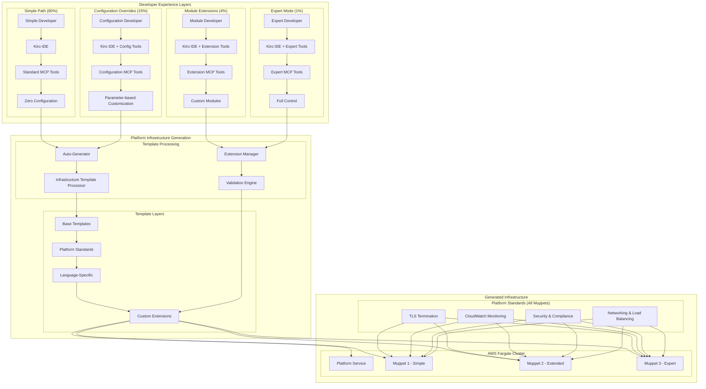

# Design Document: Muppet Platform

## Overview

The Muppet Platform is an internal developer platform that enables rapid creation and management of backend applications ("muppets") through standardized templates. The platform consists of three main components organized in separate directories: a Python-based platform service, muppet template development tools, and shared OpenTofu modules for infrastructure management.

The project follows a modular architecture with clear separation of concerns:
- **Platform Directory**: Core platform service, MCP server, and deployment infrastructure
- **Templates Directory**: Muppet template development, testing, and validation tools
- **OpenTofu Modules Directory**: Shared, versioned infrastructure modules used by both platform and muppets

## Project Structure

```
muppet-platform/
├── platform/                  # Core platform service
│   ├── src/                   # Platform source code
│   ├── tests/                 # Platform unit tests
│   ├── mcp/                   # MCP server implementation
│   ├── terraform/             # Platform infrastructure
│   ├── docker/                # Platform containerization
│   └── .github/workflows/     # Platform CI/CD
│
├── templates/                  # Muppet template development
│   ├── java-micronaut/        # Java Micronaut template (initial)
│   ├── template-tools/        # Template development utilities
│   ├── tests/                 # Template validation tests
│   └── .github/workflows/     # Template CI/CD
│
├── terraform-modules/         # Shared infrastructure modules
│   ├── fargate-service/       # Reusable Fargate service module
│   ├── monitoring/            # CloudWatch monitoring module
│   ├── networking/            # VPC and networking module
│   ├── ecr/                   # Shared ECR registry module
│   ├── tests/                 # OpenTofu module tests
│   └── .github/workflows/     # Module CI/CD
│
├── steering-docs/             # Centralized steering documentation
│   ├── shared/                # Platform-managed steering docs
│   │   ├── http-responses.md  # HTTP status code standards
│   │   ├── test-coverage.md   # 70% minimum coverage requirement
│   │   ├── security.md        # Security best practices
│   │   ├── logging.md         # Logging standards
│   │   └── performance.md     # Performance guidelines
│   ├── templates/             # Template-specific steering additions
│   └── .github/workflows/     # Steering docs CI/CD
│
└── docs/                      # Project documentation
    ├── platform/              # Platform documentation
    ├── templates/             # Template development guide
    └── terraform/             # Infrastructure documentation
```

## Architecture

The Muppet Platform implements a **"Simple by Default, Extensible by Choice"** architecture with **Layered Extensibility** that provides zero-config experience for 80% of developers while offering progressive levels of customization for power users.

### Layered Extensibility Architecture

The platform provides four distinct levels of infrastructure extensibility:

```
┌─────────────────────────────────────────────────────────────┐
│ Layer 4: Expert Mode (1% - Full Control)                   │
│ ├── Custom OpenTofu files with platform integration        │
│ ├── Multi-region deployments, complex networking           │
│ └── Organization-specific compliance and security patterns │
├─────────────────────────────────────────────────────────────┤
│ Layer 3: Module Extensions (4% - Custom Components)        │
│ ├── Custom modules (Redis, databases, queues)              │
│ ├── Organization-specific infrastructure patterns          │
│ └── Additional AWS resources with platform integration     │
├─────────────────────────────────────────────────────────────┤
│ Layer 2: Configuration Overrides (15% - Parameter-based)   │
│ ├── Resource scaling (CPU, memory, auto-scaling limits)    │
│ ├── Custom domains, monitoring settings, log retention     │
│ └── Environment-specific configurations                    │
├─────────────────────────────────────────────────────────────┤
│ Layer 1: Simple Path (80% - Zero Configuration)            │
│ ├── Auto-generated infrastructure with platform standards  │
│ ├── TLS, monitoring, security, compliance built-in         │
│ └── Java 21 LTS enforcement and production-ready defaults  │
└─────────────────────────────────────────────────────────────┘
```

### Infrastructure Template Architecture

**Template-Based Generation with Platform Standards:**
- **Platform-managed base infrastructure** (security, TLS, monitoring, networking)
- **Language-specific optimizations** (Java 21 LTS, JVM tuning, framework-specific configs)
- **Muppet-level customization** through configuration files and extension points
- **Expert-level control** with custom OpenTofu while preserving platform integration

See [Layered Extensibility Architecture](layered-extensibility-architecture.md) for detailed implementation.



### Infrastructure Template Management

**Consolidated Template Architecture:**
All infrastructure templates are managed centrally in `platform/infrastructure-templates/` with the following structure:

```
platform/infrastructure-templates/
├── base/                           # Layer 1: Base Infrastructure
│   ├── main.tf.template           # Core AWS resources (VPC, ALB, ECS, ECR)
│   ├── variables.tf.template      # Standard variables with validation
│   ├── outputs.tf.template        # Standard outputs
│   └── versions.tf.template       # Provider requirements
├── platform/                      # Layer 2: Platform Standards
│   ├── security.tf.template       # Security baseline (TLS, WAF, headers)
│   ├── monitoring.tf.template     # CloudWatch monitoring and alarms
│   ├── tls.tf.template            # TLS certificate management
│   └── compliance.tf.template     # Compliance and cost optimization
├── templates/                      # Layer 3: Template Extensions
│   ├── java/
│   │   ├── fargate-java.tf.template    # Java-optimized Fargate (Java 21 LTS)
│   │   ├── monitoring-java.tf.template # JVM-specific monitoring
│   │   └── variables-java.tf.template  # Java-specific variables
│   └── python/                     # Future: Python-specific templates
└── extensions/                     # Layer 4: Extension Framework
    ├── hooks/                      # Extension points for custom modules
    ├── validators/                 # Custom validation rules
    └── examples/                   # Extension examples and documentation
```

**Template Processing Flow:**
1. **Base Infrastructure**: Core AWS resources with sensible defaults
2. **Platform Standards**: Security, TLS, monitoring applied to all muppets
3. **Language Optimization**: Java 21 LTS enforcement, JVM tuning, framework configs
4. **Muppet Extensions**: Custom modules, overrides, and expert-mode customizations

**Benefits:**
- **Single Source of Truth**: All infrastructure templates in one location
- **Platform Standards Enforcement**: Security, compliance, Java 21 LTS enforced consistently
- **Progressive Extensibility**: Four levels of customization without breaking platform standards
- **Maintainability**: Infrastructure evolution happens centrally with proper validation

## Components and Interfaces

### Muppet Developer Experience with Kiro

When a muppet is created, developers receive a fully configured Kiro workspace for their muppet development:

**Generated Kiro Configuration (.kiro/):**
- **Settings**: Language-specific configurations, linters, formatters
- **Shared Steering Files**: Centrally managed best practices (HTTP responses, test coverage, security)
- **Muppet-Specific Steering**: Additional steering docs specific to the muppet
- **MCP Integration**: Connection to platform MCP tools for deployment and monitoring
- **Development Workflows**: Common tasks like build, test, deploy accessible through Kiro

**Steering File Structure in Generated Muppets:**
```
.kiro/steering/
├── shared/                    # Centrally managed (auto-updated)
│   ├── http-responses.md      # HTTP status code standards
│   ├── test-coverage.md       # 70% minimum coverage requirement
│   ├── security.md            # Security best practices
│   ├── logging.md             # Logging standards
│   └── performance.md         # Performance guidelines
└── muppet-specific/           # Muppet developer managed
    ├── business-logic.md      # Muppet-specific patterns
    └── integration.md         # External service integration guides
```

**Developer Workflow:**
1. Create muppet through platform MCP tools in Kiro
2. Clone generated private GitHub repository
3. Open muppet in Kiro with pre-configured settings
4. Develop using Kiro's AI assistance with framework-specific guidance
5. Test locally using provided scripts and Rancher Desktop
6. Deploy to AWS through platform MCP tools or GitHub Actions

### 1. MCP Server Component

The MCP Server provides the interface between Kiro and the Platform Service, implementing the Model Context Protocol specification.

**Key Responsibilities:**
- Expose muppet management tools to Kiro
- Handle authentication and authorization
- Validate input parameters
- Provide real-time status updates

**MCP Tools Exposed:**
- `create_muppet(name: str, template: str)` - Create new muppet from any available template with Kiro configuration and shared steering
- `delete_muppet(name: str)` - Remove muppet and cleanup resources
- `list_muppets()` - Show all active muppets with their template types
- `list_templates()` - Show all available templates for muppet creation
- `get_muppet_status(name: str)` - Get detailed muppet information
- `get_muppet_logs(name: str, lines: int)` - Retrieve muppet logs
- `setup_muppet_dev(name: str)` - Configure local Kiro environment for muppet development
- `update_shared_steering()` - Update shared steering docs across all muppets
- `list_steering_docs()` - Show available shared and muppet-specific steering documentation
- `update_muppet_pipelines(muppet_name: str, workflow_version: str)` - Update muppet's CI/CD pipelines to specific workflow version
- `list_workflow_versions(template_type: str)` - Show available workflow versions for a template type
- `rollback_muppet_pipelines(muppet_name: str, workflow_version: str)` - Rollback muppet pipelines to previous version

### 2. Platform Service Component

The core orchestration service that manages muppet lifecycle and coordinates with external services.

**Key Responsibilities:**
- Muppet lifecycle management (create, deploy, monitor, destroy)
- Template processing and customization
- Infrastructure provisioning through Terraform
- GitHub repository management
- Health monitoring and logging

**Internal APIs:**
- Template Engine API for code generation
- Infrastructure Manager API for AWS resource management
- GitHub Integration API for repository operations
- Monitoring API for health checks and metrics

### 3. Template Manager Component

Manages muppet templates with **dual-path architecture**: simplified templates for zero-config experience and advanced templates for power users. Located in the `templates/` directory with support for both simple and extensible template types.

**Key Responsibilities:**
- Template discovery and validation for both simple and advanced templates
- Auto-generation of infrastructure, CI/CD, and Kiro configurations for simple templates
- Custom module integration and override support for power user templates
- Progressive disclosure of complexity based on developer needs
- Template inheritance and organization-specific customization

**Simple Template Structure (Zero-Config):**

For 80% of developers who want zero configuration:
```
templates/java-micronaut-simple/
├── template.yaml              # Minimal metadata only
├── src/                       # Application source code template
├── scripts/                   # Development script templates
└── README.template.md         # Simple documentation
```

**Advanced Template Structure (Power Users):**

For 20% of developers who need full control:
```
templates/java-micronaut-advanced/
├── template.yaml              # Extended metadata with hooks
├── src/                       # Application source code template
├── infrastructure/            # Custom OpenTofu modules
│   ├── custom-modules/        # Organization-specific modules
│   ├── overrides/             # Infrastructure overrides
│   └── extensions/            # Extension points
├── .github/                   # Custom workflow templates
│   ├── workflows/             # Custom CI/CD logic
│   └── templates/             # Workflow inheritance
├── .kiro/                     # Advanced Kiro configuration
│   ├── extensions/            # Custom extensions
│   └── custom-tools/          # Organization-specific tools
└── config/                    # Advanced configuration options
```

**Auto-Generation System:**
The Template Manager includes an Auto-Generator component that creates all infrastructure, CI/CD, and Kiro configurations for simple templates:
- **Infrastructure**: Complete OpenTofu configurations with TLS, monitoring, security
- **CI/CD**: GitHub Actions workflows optimized for the template type
- **Kiro Config**: Language servers, debugging, steering documentation
- **Security**: TLS certificates, vulnerability scanning, compliance checks

**Centralized Pipeline Management:**
Each template maintains its own shared GitHub Actions workflows that provide centralized CI/CD logic:
- **Shared Workflows** (`.github/workflows/`): Reusable workflows containing the actual pipeline logic
- **Workflow Templates** (`.github-templates/workflows/`): Minimal workflow files that muppets use to call shared workflows
- **Template-Specific Logic**: Each template type (Java, Go) has optimized workflows for its technology stack
- **Versioned Updates**: Template maintainers can update shared workflows and roll out changes to all muppets of that type

**Initial Template: Java Micronaut (templates/java-micronaut/)**
- Amazon Corretto Java distribution
- Micronaut framework with common dependencies
- Port 3000 default configuration
- Gradle build system
- JUnit 5 test framework

**Future Template Examples:**
Additional templates may be added in the future based on organizational needs and technology adoption.

**Template Development Tools (templates/template-tools/):**
- Template validation and linting
- Code generation testing across all templates
- Template versioning utilities
- Parameter injection testing
- Template scaffolding for creating new templates

**Template Testing Framework (templates/{template-name}/tests/):**
Each template includes comprehensive automated testing to ensure reliability:
- **Quick Validation Tests** (1-2 minutes): Fast template generation, build validation, and JAR creation
- **Comprehensive Test Suite** (5-10 minutes): Full end-to-end testing including Docker builds, container startup, and endpoint validation
- **Java 21 LTS Enforcement**: Automatic detection and enforcement of Java 21 LTS requirements
- **Cross-Platform Compatibility**: Tests run on multiple environments to ensure consistency
- **Containerization Testing**: Validates Docker image creation, container startup, and health checks
- **API Endpoint Testing**: Verifies all health and business endpoints respond correctly

**Template Verification Workflow for Template Developers:**
Template developers need a systematic way to verify that muppets instantiated from their templates work correctly end-to-end:

- **Muppet Instantiation Verification**: Automated system to create test muppets from templates and verify parameter injection works correctly
- **End-to-End Functionality Testing**: Validate that instantiated muppets start up, respond to health checks, and serve API endpoints correctly  
- **Integration Testing**: Test muppet creation through platform MCP tools, GitHub repository creation, and CI/CD pipeline execution
- **Template Quality Gates**: Enforce verification requirements before template releases, including compatibility matrices and edge case testing
- **Developer Verification Scripts**: `verify-template.sh` for comprehensive testing and `test-muppet-instantiation.sh` for quick verification
- **Automated Cleanup**: Automatic removal of test muppets and resources after verification completes
- **Regression Testing**: Validate template changes don't break existing functionality across different muppet naming patterns

**Template Test Structure:**
```
templates/{template-name}/tests/
├── test-template.sh           # Comprehensive end-to-end test suite
├── quick-test.sh             # Fast validation for development
├── verify-template.sh         # Template developer verification workflow
├── test-muppet-instantiation.sh  # Quick muppet instantiation testing
├── README.md                 # Test documentation and troubleshooting
└── fixtures/                 # Test data and configuration files
```

**Template Verification Scripts:**
- **verify-template.sh**: Comprehensive template verification including muppet creation, GitHub integration, and cleanup
- **test-muppet-instantiation.sh**: Quick verification that template generates working muppets with proper parameter injection
- **cleanup-test-muppets.sh**: Automated cleanup of test muppets and associated resources

**Kiro Integration for Muppet Development:**
Each generated muppet includes Kiro-specific configuration to enable seamless development:
- `.kiro/` directory with muppet-specific settings
- MCP server configuration for local development tools
- Steering files with muppet development best practices
- Integration with platform MCP tools for deployment and monitoring

### 4. GitHub Manager Component

Handles all GitHub operations including repository creation, code pushing, and CI/CD setup. All repositories are created under the "muppet-platform" organization.

**Key Responsibilities:**
- Repository creation under "muppet-platform" organization (https://github.com/muppet-platform)
- Create private repositories for each muppet instance
- Initial code push from templates
- Branch protection and workflow setup
- Access control and permissions

**Repository Organization:**
- **Platform Repository**: `https://github.com/muppet-platform/platform` (private)
- **Templates Repository**: `https://github.com/muppet-platform/templates` (private)
- **Terraform Modules Repository**: `https://github.com/muppet-platform/terraform-modules` (private)
- **Steering Docs Repository**: `https://github.com/muppet-platform/steering-docs` (private)
- **Muppet Repositories**: `https://github.com/muppet-platform/{muppet-name}` (private)

### 5. Infrastructure Manager Component

Manages AWS infrastructure provisioning and OpenTofu module coordination. Uses shared modules from the `terraform-modules/` directory.

**Key Responsibilities:**
- OpenTofu module version management
- AWS resource provisioning
- Fargate service deployment
- Network and security configuration
- Shared ECR registry management for all platform and muppet containers

**Shared OpenTofu Modules (terraform-modules/):**
- **fargate-service/**: Reusable Fargate service with load balancer, auto-scaling, and health checks
- **monitoring/**: CloudWatch logging, metrics, alarms, and dashboards
- **networking/**: VPC, subnets, security groups, and NAT gateways
- **ecr/**: Shared ECR registry with lifecycle policies and security scanning
- **iam/**: IAM roles and policies for platform and muppet services

### 6. Container Registry Management

All containers (platform and muppets) use a shared Amazon ECR registry for consistency and cost optimization.

**Key Responsibilities:**
- Centralized container image storage
- Image versioning and lifecycle management
- Security scanning and vulnerability management
- Access control and permissions for platform and muppet images

### 7. State Management Component

The platform manages state without requiring a traditional database by leveraging AWS native services and GitHub as the source of truth.

**State Storage Strategy:**
- **GitHub as Source of Truth**: Muppet metadata stored in private GitHub repository topics, descriptions, and README files under the "muppet-platform" organization (all repositories private)
- **AWS Systems Manager Parameter Store**: Platform configuration, OpenTofu module versions, and operational settings
- **S3 for Artifacts**: Template artifacts, generated configurations, and deployment logs
- **CloudWatch for Operational State**: Real-time status, metrics, and health information
- **ECS Service Discovery**: Dynamic service registry for active muppets

**Key Responsibilities:**
- Query GitHub API to discover active muppets and their metadata
- Store platform configuration in Parameter Store with hierarchical organization
- Cache frequently accessed data in memory with TTL-based invalidation
- Aggregate real-time status from CloudWatch and ECS APIs
- Maintain consistency through eventual consistency patterns

### 8. Pipeline Management Component

Manages centralized CI/CD pipeline logic for all muppets while allowing template-specific customization.

**Key Responsibilities:**
- Maintain shared GitHub Actions workflows within each template directory
- Generate minimal muppet workflow files that reference shared workflows
- Provide versioned pipeline updates across all muppets of a template type
- Support template-specific pipeline logic (Java vs Python vs Go)
- Enable controlled rollout of pipeline changes

**Pipeline Architecture:**
- **Shared Workflows** (`templates/{template-name}/.github/workflows/`): Reusable workflows containing centralized CI/CD logic
- **Workflow Templates** (`templates/{template-name}/.github-templates/workflows/`): Minimal workflow files generated for each muppet
- **Template-Specific Logic**: Each template type has optimized workflows for its technology stack
- **Version Management**: Workflows are versioned and can be pinned to specific versions for stability

**Pipeline Update Process:**
1. Template maintainer updates shared workflow in template repository
2. Platform detects workflow changes and creates new version
3. MCP tools allow selective update of muppets to new workflow version
4. Muppets can pin to specific workflow versions for stability

**Generated Muppet Workflow Example:**
```yaml
# Generated in muppet repository: .github/workflows/ci.yml
name: CI
on: [push, pull_request]

jobs:
  ci:
    uses: muppet-platform/templates/.github/workflows/shared-ci.yml@java-micronaut-v1.2.3
    with:
      template_type: java-micronaut
      java_version: "21"
      muppet_name: ${{ github.repository }}
    secrets: inherit
```

### 9. Centralized Steering Management Component

Manages shared steering documentation that applies to all muppets, while allowing muppet-specific additions.

**Centralized Steering Repository**: `https://github.com/muppet-platform/steering-docs` (private)

**Shared Steering Documents:**
- **HTTP Response Standards** (`shared/http-responses.md`): Proper HTTP status codes, error handling patterns, and API response formats
- **Test Coverage Requirements** (`shared/test-coverage.md`): Minimum 70% test coverage requirements, testing best practices, and coverage reporting
- **Security Guidelines** (`shared/security.md`): Authentication, authorization, and security best practices
- **Logging Standards** (`shared/logging.md`): Structured logging, log levels, and monitoring integration
- **Performance Guidelines** (`shared/performance.md`): Response time targets, resource usage, and optimization practices

**Steering Distribution Strategy:**
- Platform automatically includes shared steering docs in all generated muppets
- Muppet developers can add muppet-specific steering docs in their `.kiro/steering/` directory
- Shared steering docs are versioned and can be updated centrally
- Platform MCP tools can update shared steering across all muppets

**Key Responsibilities:**
- Maintain centralized steering documentation repository
- Distribute shared steering docs to all muppets during creation
- Version and update shared steering docs across existing muppets
- Allow muppet-specific steering additions without conflicts

## Data Models

### Muppet Model
```python
@dataclass
class Muppet:
    name: str
    template: str
    status: MuppetStatus
    github_repo_url: str
    fargate_service_arn: str
    created_at: datetime
    updated_at: datetime
    opentofu_version: str
    port: int = 3000
    
    def to_dict(self) -> dict:
        return asdict(self)
    
    @classmethod
    def from_github_repo(cls, repo) -> 'Muppet':
        """Reconstruct muppet state from GitHub repository metadata"""
        # Parse topics, description, and README to extract muppet metadata
        pass
```

### State Reconstruction Model
```python
@dataclass
class PlatformState:
    muppets: List[Muppet]
    active_deployments: Dict[str, str]  # muppet_name -> fargate_arn
    opentofu_versions: Dict[str, str]  # module_name -> version
    
    @classmethod
    def load_from_sources(cls) -> 'PlatformState':
        """Reconstruct complete platform state from GitHub, Parameter Store, and ECS"""
        # Query GitHub for muppet repositories
        # Query Parameter Store for configuration
        # Query ECS for active services
        # Aggregate into consistent state view
        pass
```

### Template Model
```python
@dataclass
class Template:
    name: str                    # e.g., "java-micronaut"
    version: str
    description: str
    language: str               # e.g., "java", "nodejs", "go"
    framework: str              # e.g., "micronaut", "express", "gin"
    opentofu_modules: List[str]
    required_variables: List[str]
    supported_features: List[str]  # e.g., ["database", "auth", "monitoring"]
    
    def validate(self) -> bool:
        # Template validation logic
        pass
    
    @classmethod
    def discover_templates(cls) -> List['Template']:
        """Discover all available templates in the templates directory"""
        pass
```

### Infrastructure Configuration Model
```python
@dataclass
class InfrastructureConfig:
    muppet_name: str
    template_name: str
    opentofu_module_versions: Dict[str, str]
    aws_region: str
    fargate_cluster: str
    vpc_config: VPCConfig
    monitoring_config: MonitoringConfig
```

Now I need to use the prework tool to analyze the acceptance criteria before writing the Correctness Properties section.
## Correctness Properties

*A property is a characteristic or behavior that should hold true across all valid executions of a system—essentially, a formal statement about what the system should do. Properties serve as the bridge between human-readable specifications and machine-verifiable correctness guarantees.*

### Property 1: Muppet Creation Completeness
*For any* valid muppet name and template type, when a muppet is created, the platform should successfully create the muppet, provision infrastructure, create a GitHub repository, and populate it with template code.
**Validates: Requirements 1.1, 1.2, 9.1, 9.2**

### Property 2: Muppet Deletion Cleanup
*For any* existing muppet, when deletion is requested, all associated resources (Fargate services, GitHub repositories, infrastructure) should be completely removed and no longer appear in the platform registry.
**Validates: Requirements 1.3**

### Property 3: Registry Consistency
*For any* sequence of muppet operations (create, delete), the platform registry should always accurately reflect the current state by reconstructing it from GitHub repositories, Parameter Store, and ECS services.
**Validates: Requirements 1.5**

### Property 4: Template Structure Compliance
*For any* muppet created from a template, the generated configuration should reference shared OpenTofu modules (not inline code) and contain only muppet-specific parameters while inheriting shared infrastructure patterns.
**Validates: Requirements 2.2, 4.2, 4.5**

### Property 5: Fargate Deployment Consistency
*For any* created muppet, the platform should deploy it on AWS Fargate with appropriate networking and security group configurations.
**Validates: Requirements 3.2, 3.3**

### Property 6: OpenTofu Module Versioning
*For any* OpenTofu module update, the platform should support controlled updates to existing muppets while maintaining version consistency across the system.
**Validates: Requirements 4.3, 4.4**

### Property 7: GitHub Repository Configuration
*For any* created muppet, the associated private GitHub repository should be created under the "muppet-platform" organization with appropriate branch protection rules and CI/CD workflows.
**Validates: Requirements 9.3, 9.4, 9.5**

### Property 8: MCP Authentication
*For any* MCP command execution, unauthorized requests should be rejected while authorized requests should be processed successfully.
**Validates: Requirements 7.5**

### Property 9: Error Handling Consistency
*For any* operation that encounters an error condition, the platform should implement proper error handling with appropriate logging and user feedback.
**Validates: Requirements 8.4**

### Property 10: Monitoring Configuration
*For any* deployed muppet or platform component, CloudWatch logging, metrics, alarms, and cost-optimized monitoring should be properly configured.
**Validates: Requirements 11.1, 11.2, 11.3, 11.4, 11.6**

### Property 11: Template Testing Validation
*For any* template modification or new template creation, the automated test suite should validate template generation, build processes, containerization, and endpoint functionality before allowing template release.
**Validates: Requirements 12.1, 12.2, 12.3, 12.4, 12.5**

### Property 12: Template Verification Workflow
*For any* template development or modification, template developers should be able to verify that muppets instantiated from their templates work correctly end-to-end, including muppet creation through platform MCP tools, GitHub repository setup, and functional validation of the generated application.
**Validates: Requirements 1.1, 1.2, 2.1, 2.2, 12.1, 12.2, 12.3**

### Property 12: Centralized Pipeline Management
*For any* muppet created from a template, the generated CI/CD workflows should reference the template's shared workflows, and when template workflows are updated, all muppets of that type should be able to adopt the new workflow versions through controlled updates.
**Validates: Requirements 13.1, 13.2, 13.3, 13.4, 13.5, 13.6**

## Error Handling

The platform implements comprehensive error handling across all components:

### MCP Server Error Handling
- **Input Validation Errors**: Return structured error responses with clear messages
- **Authentication Failures**: Return 401 with appropriate error details
- **Platform Service Unavailable**: Return 503 with retry guidance
- **Timeout Errors**: Return 408 with operation status

### Platform Service Error Handling
- **Template Not Found**: Return descriptive error with available templates
- **Infrastructure Provisioning Failures**: Rollback partial deployments and return detailed error
- **GitHub API Failures**: Retry with exponential backoff, fallback to manual instructions
- **AWS Service Failures**: Implement circuit breaker pattern with graceful degradation

### Template Processing Error Handling
- **Invalid Template Structure**: Validate templates on load with detailed error reporting
- **Missing Dependencies**: Check and report missing template dependencies
- **Code Generation Failures**: Provide specific error location and suggested fixes

### Infrastructure Manager Error Handling
- **OpenTofu Execution Failures**: Capture and return OpenTofu error output
- **AWS Resource Limits**: Detect quota issues and provide guidance
- **Network Configuration Errors**: Validate network settings before deployment

## Testing Strategy

The Muppet Platform employs a dual testing approach combining unit tests for specific scenarios and property-based tests for comprehensive validation.

### Unit Testing Approach
Unit tests focus on:
- **Platform Unit Tests**: Comprehensive test coverage for all platform components (MCP server, template manager, GitHub manager, infrastructure manager)
- **Muppet Unit Tests**: Each generated muppet includes a complete unit test suite for its application logic
- **Specific Examples**: Test concrete scenarios like creating a muppet named "test-app" with "java-micronaut" template
- **Edge Cases**: Test boundary conditions like maximum name lengths, special characters in names
- **Error Conditions**: Test specific failure scenarios like invalid templates, network failures
- **Integration Points**: Test component interactions and API contracts

### CI/CD Testing Requirements
Each directory has its own specialized CI/CD pipeline:

**Platform CI/CD (platform/.github/workflows/):**
- Run full unit test suite on every pull request
- Execute property-based tests with minimum 100 iterations
- Perform integration tests against test AWS environment
- Build and push platform container to shared ECR
- Deploy to staging environment for validation

**Template CI/CD (templates/.github/workflows/):**
- Validate template structure and metadata
- Test code generation with various parameters
- Generate sample muppets and run their tests
- Validate OpenTofu module references
- Test template development tools

**OpenTofu Module CI/CD (terraform-modules/.github/workflows/):**
- Run tofu validate and plan on all modules
- Execute terratest integration tests
- Test module compatibility across versions
- Validate module documentation and examples
- Publish versioned modules to registry

**Muppet CI/CD (Generated in Templates):**
- Run muppet-specific unit tests on every commit
- Execute build process and create container image
- Push container image to shared ECR registry
- Deploy to development/staging environments
- Require all tests to pass before production deployment

### Property-Based Testing Approach
Property-based tests validate universal properties across randomized inputs:
- **Comprehensive Input Coverage**: Generate random muppet names, template types, and configurations
- **State Consistency**: Verify system state remains consistent across operation sequences
- **Resource Cleanup**: Ensure all resources are properly cleaned up regardless of input
- **Configuration Correctness**: Validate generated configurations across all possible inputs

### Testing Framework Configuration
- **Framework**: pytest with Hypothesis for property-based testing
- **Test Iterations**: Minimum 100 iterations per property test
- **Test Tagging**: Each property test tagged with format: **Feature: muppet-platform, Property {number}: {property_text}**
- **Mock Strategy**: Minimize mocking to test real functionality; use test AWS accounts and GitHub organizations
- **CI Integration**: All tests run on every pull request with parallel execution for performance

### Test Environment Setup
- **Local Testing**: Docker Compose setup with LocalStack for AWS service simulation
- **Integration Testing**: Dedicated AWS account with isolated resources
- **GitHub Testing**: Test organization with automated cleanup
- **Performance Testing**: Load testing for concurrent muppet operations
- **Shared ECR Testing**: Test container builds and deployments using shared ECR registry
- **Cross-Platform Testing**: Validate that both platform and muppet containers work correctly with shared infrastructure

The testing strategy ensures both specific correctness (unit tests) and general correctness (property tests) while maintaining fast feedback cycles for developers.