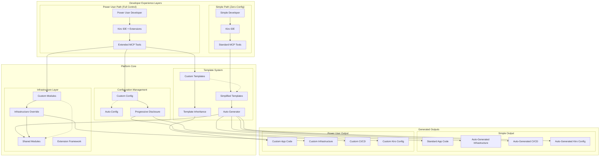

# Simple by Default, Extensible by Choice Architecture

## Overview

The Muppet Platform implements a dual-path architecture that provides **zero-config experience for 80% of developers** while offering **full extensibility for power users**. This design ensures that complexity is optional and progressive.

## Core Design Philosophy

### Principle: Simple by Default, Extensible by Choice

1. **Simple Path (80% of developers)**: Zero-config experience with auto-generated everything
2. **Power User Path (20% of developers)**: Full control with custom infrastructure, templates, and configurations
3. **Progressive Disclosure**: Complexity is hidden by default but accessible when needed
4. **No Lock-in**: Simple developers can graduate to power users seamlessly

## Architecture Overview



## Component Architecture

### 1. Template System Architecture

#### Simple Templates (Zero-Config)
```
templates/java-micronaut-simple/
├── template.yaml                 # Minimal metadata only
├── src/                         # Application code templates
│   ├── main/java/               # Business logic focus
│   │   └── {{java_package_name}}/
│   │       ├── Application.java
│   │       ├── controller/
│   │       ├── service/
│   │       └── model/
│   └── test/java/               # Test templates
│       └── {{java_package_name}}/
├── scripts/                     # Development scripts
│   ├── build.sh
│   ├── test.sh
│   └── run.sh
└── README.template.md           # Simple documentation
```

**Simple Template Metadata:**
```yaml
# template.yaml - Simple version
name: java-micronaut
version: "1.0.0"
description: "Java Micronaut service"
language: java
framework: micronaut
port: 3000

# Minimal metadata - everything else auto-generated
metadata:
  java_version: "21"
  micronaut_version: "4.0.4"
  
# Auto-generation enabled by default
auto_generate:
  infrastructure: true
  cicd: true
  kiro: true
  tls: true
```

#### Power User Templates (Full Control)
```
templates/java-micronaut-advanced/
├── template.yaml                # Extended metadata with hooks
├── src/                        # Application code templates
├── infrastructure/             # Custom OpenTofu modules
│   ├── custom-modules/         # Organization-specific modules
│   │   ├── custom-database/
│   │   ├── custom-monitoring/
│   │   └── organization-networking/
│   ├── overrides/              # Infrastructure overrides
│   │   ├── fargate-overrides.tf
│   │   └── monitoring-overrides.tf
│   └── extensions/             # Extension points
│       └── hooks.tf
├── .github/                    # Custom workflow templates
│   ├── workflows/              # Custom CI/CD logic
│   │   ├── custom-ci.yml
│   │   └── custom-deploy.yml
│   └── templates/              # Workflow inheritance
│       └── base-workflow.yml
├── .kiro/                      # Advanced Kiro configuration
│   ├── extensions/             # Custom extensions
│   ├── debugging/              # Advanced debugging configs
│   └── custom-tools/           # Organization-specific tools
└── config/                     # Advanced configuration options
    ├── environments/           # Environment-specific configs
    │   ├── development.yaml
    │   ├── staging.yaml
    │   └── production.yaml
    └── features/               # Feature toggles
        └── feature-flags.yaml
```

**Power User Template Metadata:**
```yaml
# template.yaml - Advanced version
name: java-micronaut-advanced
version: "1.0.0"
description: "Advanced Java Micronaut service with full customization"
language: java
framework: micronaut
port: 3000

# Power user features
extensibility:
  custom_modules: true
  infrastructure_overrides: true
  custom_workflows: true
  template_inheritance: true

# Custom infrastructure modules
infrastructure:
  modules:
    - name: custom-database
      source: "./infrastructure/custom-modules/custom-database"
      version: "1.0.0"
    - name: custom-monitoring
      source: "./infrastructure/custom-modules/custom-monitoring"
      version: "1.2.0"
    - name: organization-networking
      source: "git::https://github.com/org/terraform-modules.git//networking"
      version: "v2.1.0"
  
  overrides:
    - fargate-service: "./infrastructure/overrides/fargate-overrides.tf"
    - monitoring: "./infrastructure/overrides/monitoring-overrides.tf"

# Custom workflows
workflows:
  inheritance: "organization-base"
  custom_steps: true
  templates:
    - ci: ".github/workflows/custom-ci.yml"
    - deploy: ".github/workflows/custom-deploy.yml"

# Advanced Kiro configuration
kiro:
  extensions:
    - organization-tools
    - custom-debugger
    - advanced-profiler
  custom_tools:
    - name: "deploy-to-staging"
      command: "./scripts/deploy-staging.sh"
    - name: "run-integration-tests"
      command: "./scripts/integration-tests.sh"
```

### 2. Auto-Generator Architecture

The Auto-Generator is the core component that enables the zero-config experience:

```python
class AutoGenerator:
    """
    Automatically generates infrastructure, CI/CD, and Kiro configurations
    for simplified templates.
    """
    
    def generate_all(self, template_metadata, muppet_name, output_path):
        """Generate all configurations based on template type."""
        config = self._determine_generation_config(template_metadata)
        
        if config.generate_infrastructure:
            self.generate_infrastructure(template_metadata, muppet_name, output_path, config)
        
        if config.generate_cicd:
            self.generate_cicd(template_metadata, muppet_name, output_path, config)
        
        if config.generate_kiro:
            self.generate_kiro_config(template_metadata, muppet_name, output_path, config)
```

#### Infrastructure Generation Strategy

**For Simple Templates:**
- Auto-generate complete OpenTofu configurations
- Use shared modules with sensible defaults
- Include TLS termination, monitoring, security
- Zero configuration required from developer

**Generated Infrastructure Components:**
```hcl
# Auto-generated main.tf
module "fargate_service" {
  source = "git::https://github.com/muppet-platform/terraform-modules.git//fargate-service?ref=v1.0.0"
  
  service_name = var.muppet_name
  container_port = 3000
  enable_tls = true
  # ... all defaults configured
}

module "tls" {
  source = "git::https://github.com/muppet-platform/terraform-modules.git//tls?ref=v1.0.0"
  
  domain_name = "${var.muppet_name}.muppet-platform.internal"
  # ... automatic certificate management
}

module "monitoring" {
  source = "git::https://github.com/muppet-platform/terraform-modules.git//monitoring?ref=v1.0.0"
  
  service_name = var.muppet_name
  # ... comprehensive monitoring setup
}
```

### 3. MCP Tools Architecture

#### Simple Developer MCP Tools
```python
class SimpleMCPTools:
    """Zero-config MCP tools for simple developers."""
    
    async def create_muppet(self, name: str, template: str = "java-micronaut"):
        """Create muppet with zero configuration."""
        # Uses all defaults, auto-generates everything
        
    async def deploy_muppet(self):
        """Deploy current muppet with defaults."""
        # Auto-detects configuration, deploys with TLS
        
    async def get_logs(self, follow: bool = False):
        """Get muppet logs with smart defaults."""
        
    async def run_tests(self):
        """Run tests with auto-detected configuration."""
```

#### Power User MCP Tools
```python
class PowerUserMCPTools:
    """Extended MCP tools with full control."""
    
    async def create_muppet_advanced(
        self, 
        name: str, 
        template: str,
        custom_config: Dict[str, Any]
    ):
        """Create muppet with custom configuration."""
        
    async def extend_infrastructure(self, module_path: str):
        """Add custom infrastructure module."""
        
    async def override_workflow(self, workflow_name: str, custom_steps: List[str]):
        """Override CI/CD workflow with custom steps."""
        
    async def configure_environment(self, env_name: str, custom_vars: Dict[str, str]):
        """Configure environment-specific variables."""
        
    async def deploy_with_overrides(self, infrastructure_overrides: Dict[str, Any]):
        """Deploy with infrastructure overrides."""
```

### 4. Progressive Disclosure Mechanism

#### Level 1: Simple (Default)
- **Template**: Minimal metadata, application code only
- **MCP Tools**: Basic operations with zero config
- **Generated**: Everything (infrastructure, CI/CD, Kiro)
- **Complexity**: Hidden completely

#### Level 2: Intermediate (Opt-in)
- **Template**: Basic customization options
- **MCP Tools**: Some configuration parameters
- **Generated**: Most things, with some customization
- **Complexity**: Minimal, focused options

#### Level 3: Advanced (Power User)
- **Template**: Full control over all aspects
- **MCP Tools**: Complete API surface
- **Generated**: Only what's requested
- **Complexity**: Full access to all features

### 5. Extension Framework Architecture

#### Extension Points
```python
class ExtensionFramework:
    """Framework for power user extensions."""
    
    def register_custom_module(self, module_config: CustomModuleConfig):
        """Register custom infrastructure module."""
        
    def register_workflow_override(self, workflow_override: WorkflowOverride):
        """Register custom workflow logic."""
        
    def register_kiro_extension(self, extension: KiroExtension):
        """Register custom Kiro tools."""
```

#### Custom Module Integration
```python
@dataclass
class CustomModuleConfig:
    name: str
    source_path: Path
    version: str
    variables: Dict[str, Any]
    outputs: List[str]
    dependencies: List[str]
```

## Implementation Strategy

### Phase 1: Simple Path Foundation (Current Priority)
1. **Auto-Generator Implementation**
   - Infrastructure generation
   - CI/CD workflow generation
   - Kiro configuration generation
   - TLS management integration

2. **Simplified Template Structure**
   - Minimal template.yaml
   - Application code focus
   - Auto-generation enabled

3. **Standard MCP Tools**
   - Zero-config operations
   - Smart defaults
   - Error handling

### Phase 2: Extension Framework
1. **Extension Points**
   - Hook system for custom modules
   - Override mechanisms
   - Plugin architecture

2. **Template Inheritance**
   - Base template system
   - Customization layers
   - Organization templates

3. **Progressive Disclosure UI**
   - Expert mode toggle
   - Configuration wizards
   - Complexity gradients

### Phase 3: Power User Tools
1. **Advanced MCP Tools**
   - Full control operations
   - Custom module management
   - Override systems

2. **Custom Module Integration**
   - Organization-specific modules
   - Module marketplace
   - Version management

3. **Advanced Configuration**
   - Environment-specific configs
   - Feature toggles
   - A/B testing support

## Benefits Analysis

### For Simple Developers (80%)
✅ **Zero Learning Curve**: Just write business logic  
✅ **Best Practices Built-in**: Security, monitoring, CI/CD automatically configured  
✅ **Fast Time-to-Market**: From idea to production in minutes  
✅ **Maintenance-Free**: Platform handles all infrastructure updates  
✅ **TLS by Default**: All services automatically use HTTPS  
✅ **Monitoring Included**: CloudWatch, alarms, dashboards auto-configured  

### For Power Users (20%)
✅ **Full Control**: Override any aspect of the system  
✅ **Organization Standards**: Custom modules and workflows  
✅ **Gradual Adoption**: Start simple, add complexity as needed  
✅ **No Lock-in**: Can always access and modify generated configurations  
✅ **Extension Framework**: Build organization-specific tools  
✅ **Template Marketplace**: Share and reuse custom templates  

### For Platform Team
✅ **Reduced Support**: 80% of developers need minimal help  
✅ **Standardization**: Consistent patterns across all services  
✅ **Evolution**: Can improve defaults without breaking existing services  
✅ **Flexibility**: Power users can innovate without platform changes  
✅ **Metrics**: Clear usage patterns and adoption tracking  
✅ **Maintenance**: Centralized updates to shared components  

## Example Workflows

### Simple Developer Experience
```bash
# In Kiro IDE
Developer: "Create a new user service"

# Platform automatically:
# 1. Creates java-micronaut template
# 2. Auto-generates infrastructure with TLS
# 3. Sets up CI/CD pipelines
# 4. Configures monitoring and logging
# 5. Creates GitHub repository
# 6. Deploys to AWS Fargate
# 7. Provides HTTPS endpoint

Result: Production-ready service in 2 minutes
```

### Power User Experience
```bash
# In Kiro IDE with custom configuration
Developer: "Create a new user service with custom database module and advanced monitoring"

# Platform:
# 1. Uses advanced template
# 2. Integrates custom database module
# 3. Applies organization-specific overrides
# 4. Uses custom CI/CD workflows
# 5. Configures advanced monitoring
# 6. Maintains organization standards

Result: Fully customized service following organization patterns
```

## Quality Assurance

### Testing Strategy
- **Simple Path**: Automated testing of all auto-generated configurations
- **Power User Path**: Integration testing of extension points
- **Progressive Disclosure**: UI/UX testing of complexity transitions
- **Performance**: Load testing of both paths

### Validation Rules
- Simple templates must generate valid infrastructure
- Power user extensions must not break simple path
- All generated configurations must pass security scans
- TLS must be enabled by default in all environments

## Migration Strategy

### Existing Templates
1. **Preserve Current**: Existing templates continue to work
2. **Gradual Migration**: Introduce simplified versions alongside
3. **Auto-Detection**: Platform detects template type automatically
4. **Backward Compatibility**: No breaking changes to existing workflows

### Developer Onboarding
1. **Default to Simple**: New developers start with zero-config
2. **Learning Path**: Clear progression from simple to advanced
3. **Documentation**: Separate docs for each complexity level
4. **Training**: Workshops for power user features

This architecture ensures that **complexity is optional** - simple developers never see it, but power users have full access when needed, creating the best possible experience for both audiences.