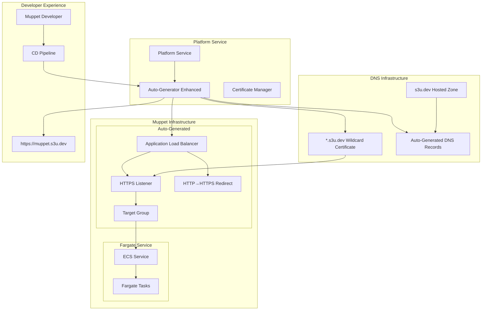

# TLS-by-Default Design Document

## Overview

This document outlines the design for implementing TLS-by-default for all muppet endpoints using the `s3u.dev` domain, ensuring zero code/configuration changes are required from muppet developers.

## Problem Statement

The platform team wants to enable TLS by default for all muppet endpoints using a domain under `s3u.dev`, with the following requirements:

- **Zero Breaking Changes**: No code or configuration changes required for existing muppets
- **Zero-Config Experience**: New muppets automatically get HTTPS endpoints
- **Simple Migration**: Muppet developers only need to re-run their CD pipelines
- **Enterprise Security**: All traffic encrypted by default

## Current State Analysis

### ✅ Platform Infrastructure (Already TLS-Ready)

The platform infrastructure (`platform/terraform/main.tf`) already has comprehensive HTTPS support:

```hcl
# Existing TLS capabilities
variable "enable_https" {
  description = "Enable HTTPS with ACM certificate"
  type        = bool
  default     = true  # Already defaults to enabled
}

variable "domain_name" {
  description = "Platform domain name"
  type        = string
  default     = "muppet-platform.s3u.dev"  # Already configured for s3u.dev
}

# Existing resources
resource "aws_acm_certificate" "platform" { ... }
resource "aws_route53_record" "platform_validation" { ... }
resource "aws_lb_listener" "platform_https" { ... }
```

### 🔧 Muppet Module (Needs Enhancement)

The muppet terraform module has TLS support but defaults to disabled:

```hcl
# Current state - needs update
variable "enable_https" {
  description = "Enable HTTPS listener on the load balancer"
  type        = bool
  default     = false  # Currently disabled by default
}

variable "certificate_arn" {
  description = "ARN of the SSL certificate for HTTPS listener"
  type        = string
  default     = ""  # Currently empty
}
```

### 🎯 Architecture Alignment

The platform's "Simple by Default, Extensible by Choice" architecture perfectly supports this enhancement:

- **Auto-Generator**: Can automatically configure TLS for all muppets
- **Zero-Config Experience**: Simple developers get TLS without configuration
- **Progressive Disclosure**: Complexity remains hidden
- **Template System**: Auto-generates TLS-enabled infrastructure

## Solution Design

### Architecture Overview



### Component Design

#### 1. DNS Infrastructure

**s3u.dev Hosted Zone Setup:**
```hcl
# New resource in platform infrastructure
resource "aws_route53_zone" "s3u_dev" {
  name = "s3u.dev"
  
  tags = merge(local.common_tags, {
    Name = "s3u-dev-zone"
    Purpose = "muppet-tls-endpoints"
  })
}

# Wildcard certificate for all muppets
resource "aws_acm_certificate" "muppet_wildcard" {
  domain_name       = "*.s3u.dev"
  validation_method = "DNS"
  
  subject_alternative_names = [
    "s3u.dev"  # Include apex domain
  ]
  
  lifecycle {
    create_before_destroy = true
  }
  
  tags = merge(local.common_tags, {
    Name = "muppet-wildcard-certificate"
    Purpose = "muppet-tls-endpoints"
  })
}

# Certificate validation
resource "aws_route53_record" "muppet_wildcard_validation" {
  for_each = {
    for dvo in aws_acm_certificate.muppet_wildcard.domain_validation_options : dvo.domain_name => {
      name   = dvo.resource_record_name
      record = dvo.resource_record_value
      type   = dvo.resource_record_type
    }
  }

  allow_overwrite = true
  name            = each.value.name
  records         = [each.value.record]
  ttl             = 60
  type            = each.value.type
  zone_id         = aws_route53_zone.s3u_dev.zone_id
}

resource "aws_acm_certificate_validation" "muppet_wildcard" {
  certificate_arn         = aws_acm_certificate.muppet_wildcard.arn
  validation_record_fqdns = [for record in aws_route53_record.muppet_wildcard_validation : record.fqdn]
  
  timeouts {
    create = "10m"
  }
}
```

#### 2. Enhanced Auto-Generator

**TLS Configuration Auto-Generation:**
```python
class TLSAutoGenerator:
    """Automatically configures TLS for all muppets."""
    
    def __init__(self, aws_client, route53_client):
        self.aws_client = aws_client
        self.route53_client = route53_client
        self.s3u_dev_zone_id = self._get_s3u_dev_zone_id()
        self.wildcard_cert_arn = self._get_wildcard_certificate_arn()
    
    def generate_muppet_tls_config(self, muppet_name: str) -> Dict[str, Any]:
        """Generate TLS configuration for a muppet."""
        return {
            "enable_https": True,
            "certificate_arn": self.wildcard_cert_arn,
            "domain_name": f"{muppet_name}.s3u.dev",
            "zone_id": self.s3u_dev_zone_id,
            "redirect_http_to_https": True,
            "ssl_policy": "ELBSecurityPolicy-TLS13-1-2-2021-06"
        }
    
    def generate_dns_record(self, muppet_name: str, load_balancer_dns: str, load_balancer_zone_id: str):
        """Auto-generate DNS record for muppet."""
        return {
            "zone_id": self.s3u_dev_zone_id,
            "name": f"{muppet_name}.s3u.dev",
            "type": "A",
            "alias": {
                "name": load_balancer_dns,
                "zone_id": load_balancer_zone_id,
                "evaluate_target_health": True
            }
        }
    
    def _get_s3u_dev_zone_id(self) -> str:
        """Get the s3u.dev hosted zone ID."""
        response = self.route53_client.list_hosted_zones_by_name(DNSName="s3u.dev")
        for zone in response["HostedZones"]:
            if zone["Name"] == "s3u.dev.":
                return zone["Id"].split("/")[-1]
        raise ValueError("s3u.dev hosted zone not found")
    
    def _get_wildcard_certificate_arn(self) -> str:
        """Get the wildcard certificate ARN."""
        response = self.aws_client.list_certificates()
        for cert in response["CertificateSummaryList"]:
            if cert["DomainName"] == "*.s3u.dev":
                return cert["CertificateArn"]
        raise ValueError("*.s3u.dev certificate not found")
```

#### 3. Enhanced Muppet Module

**Updated Default Variables:**
```hcl
# terraform-modules/muppet-java-micronaut/variables.tf
variable "enable_https" {
  description = "Enable HTTPS listener on the load balancer"
  type        = bool
  default     = true  # Changed from false to true
}

variable "certificate_arn" {
  description = "ARN of the SSL certificate for HTTPS listener"
  type        = string
  default     = ""  # Will be auto-populated by platform
}

variable "domain_name" {
  description = "Custom domain name for the muppet"
  type        = string
  default     = ""  # Will be auto-populated as {muppet_name}.s3u.dev
}

variable "zone_id" {
  description = "Route 53 hosted zone ID for DNS record creation"
  type        = string
  default     = ""  # Will be auto-populated with s3u.dev zone ID
}

variable "redirect_http_to_https" {
  description = "Redirect HTTP traffic to HTTPS"
  type        = bool
  default     = true  # New variable, defaults to enabled
}

variable "ssl_policy" {
  description = "SSL policy for HTTPS listener"
  type        = string
  default     = "ELBSecurityPolicy-TLS13-1-2-2021-06"  # Modern TLS policy
}
```

**Auto-Generated DNS Record:**
```hcl
# terraform-modules/muppet-java-micronaut/dns.tf (new file)
# DNS record for custom domain (conditional)
resource "aws_route53_record" "muppet_domain" {
  count = var.domain_name != "" && var.zone_id != "" ? 1 : 0
  
  zone_id = var.zone_id
  name    = var.domain_name
  type    = "A"
  
  alias {
    name                   = module.fargate_service.load_balancer_dns_name
    zone_id                = module.fargate_service.load_balancer_zone_id
    evaluate_target_health = true
  }
  
  tags = merge(local.common_tags, {
    Name = "${var.muppet_name}-dns-record"
    Domain = var.domain_name
  })
}
```

#### 4. Platform Service Integration

**Enhanced Muppet Creation API:**
```python
class MuppetLifecycleService:
    """Enhanced with TLS-by-default support."""
    
    def __init__(self, tls_generator: TLSAutoGenerator):
        self.tls_generator = tls_generator
    
    async def create_muppet(self, muppet_name: str, template: str = "java-micronaut") -> Dict[str, Any]:
        """Create muppet with TLS enabled by default."""
        
        # Generate TLS configuration automatically
        tls_config = self.tls_generator.generate_muppet_tls_config(muppet_name)
        
        # Generate infrastructure with TLS defaults
        infrastructure_config = {
            **self._generate_base_infrastructure(muppet_name, template),
            **tls_config  # TLS config overrides defaults
        }
        
        # Create muppet with TLS enabled
        result = await self._create_muppet_infrastructure(muppet_name, infrastructure_config)
        
        # Auto-generate DNS record after load balancer is created
        if result["success"]:
            dns_config = self.tls_generator.generate_dns_record(
                muppet_name,
                result["load_balancer_dns"],
                result["load_balancer_zone_id"]
            )
            await self._create_dns_record(dns_config)
        
        return {
            "success": result["success"],
            "muppet_name": muppet_name,
            "https_endpoint": f"https://{muppet_name}.s3u.dev",
            "http_endpoint": f"http://{result['load_balancer_dns']}",  # Still available
            "tls_enabled": True,
            "certificate_arn": tls_config["certificate_arn"],
            "domain_name": tls_config["domain_name"]
        }
```

### Migration Strategy

#### Phase 1: Infrastructure Setup (Platform Team)

1. **Create s3u.dev DNS Infrastructure**
   - Set up Route 53 hosted zone for s3u.dev
   - Request and validate wildcard SSL certificate (*.s3u.dev)
   - Update platform terraform with new resources

2. **Enhance Platform Service**
   - Implement TLSAutoGenerator class
   - Update MuppetLifecycleService with TLS defaults
   - Add certificate and zone ID discovery logic

3. **Update Terraform Modules**
   - Change muppet module defaults to enable HTTPS
   - Add DNS record creation capability
   - Update fargate-service module for TLS support

#### Phase 2: Backward-Compatible Rollout

4. **Deploy Platform Changes**
   - Deploy enhanced platform service with TLS auto-generation
   - Verify wildcard certificate is working
   - Test with one new muppet creation

5. **Gradual Migration of Existing Muppets**
   - Identify all existing muppets via GitHub organization scan
   - For each muppet:
     - Auto-generate TLS configuration
     - Create DNS record pointing to existing load balancer
     - Update muppet's terraform state with new variables
     - Notify muppet team to re-run CD pipeline

#### Phase 3: Full TLS Enforcement

6. **Verify All Muppets Have HTTPS**
   - Scan all muppets for HTTPS endpoint availability
   - Verify certificate validity and DNS resolution
   - Monitor for any issues or failures

7. **Optional: Enforce HTTPS-Only**
   - After verification period, can disable HTTP listeners
   - All traffic automatically redirected to HTTPS
   - Remove HTTP endpoints from documentation

## Implementation Details

### DNS Configuration

**s3u.dev Zone Structure:**
```
s3u.dev.                    # Apex domain (platform marketing site)
├── muppet-platform.s3u.dev    # Platform service endpoint
├── *.s3u.dev                  # Wildcard certificate coverage
├── muppet1.s3u.dev           # Individual muppet endpoints
├── muppet2.s3u.dev
└── muppet-n.s3u.dev
```

### Certificate Management

**Wildcard Certificate Benefits:**
- Single certificate covers all muppets (*.s3u.dev)
- Automatic renewal via ACM
- No per-muppet certificate management
- Cost-effective (one certificate vs. many)
- Instant HTTPS for new muppets

### Load Balancer Configuration

**Enhanced HTTPS Listener:**
```hcl
resource "aws_lb_listener" "https" {
  count = var.enable_https ? 1 : 0
  
  load_balancer_arn = aws_lb.main.arn
  port              = "443"
  protocol          = "HTTPS"
  ssl_policy        = var.ssl_policy
  certificate_arn   = var.certificate_arn
  
  default_action {
    type = "forward"
    forward {
      target_group {
        arn = aws_lb_target_group.main.arn
      }
    }
  }
}

resource "aws_lb_listener" "http_redirect" {
  count = var.enable_https && var.redirect_http_to_https ? 1 : 0
  
  load_balancer_arn = aws_lb.main.arn
  port              = "80"
  protocol          = "HTTP"
  
  default_action {
    type = "redirect"
    redirect {
      port        = "443"
      protocol    = "HTTPS"
      status_code = "HTTP_301"
    }
  }
}
```

## Security Considerations

### Certificate Security
- **Wildcard Certificate**: Managed by AWS ACM with automatic renewal
- **TLS 1.3 Policy**: Modern encryption standards enforced
- **HSTS Headers**: Can be added at application level for enhanced security

### DNS Security
- **Route 53 Hosted Zone**: Protected by AWS IAM policies
- **DNS Record Management**: Only platform service can create/modify records
- **Zone Transfer**: Disabled by default in Route 53

### Access Control
- **Certificate Access**: Only platform service has access to certificate ARN
- **DNS Management**: Restricted to platform service IAM role
- **Muppet Isolation**: Each muppet gets its own subdomain

## Monitoring and Observability

### Certificate Monitoring
```python
# CloudWatch alarms for certificate expiration
resource "aws_cloudwatch_metric_alarm" "certificate_expiry" {
  alarm_name          = "muppet-wildcard-certificate-expiry"
  comparison_operator = "LessThanThreshold"
  evaluation_periods  = "1"
  metric_name         = "DaysToExpiry"
  namespace           = "AWS/CertificateManager"
  period              = "86400"  # Daily check
  statistic           = "Average"
  threshold           = "30"     # Alert 30 days before expiry
  alarm_description   = "Muppet wildcard certificate expires in less than 30 days"
  
  dimensions = {
    CertificateArn = aws_acm_certificate.muppet_wildcard.arn
  }
}
```

### DNS Health Monitoring
```python
# Route 53 health checks for critical muppets
resource "aws_route53_health_check" "muppet_health" {
  for_each = var.critical_muppets
  
  fqdn                            = "${each.key}.s3u.dev"
  port                            = 443
  type                            = "HTTPS"
  resource_path                   = "/health"
  failure_threshold               = "3"
  request_interval                = "30"
  
  tags = {
    Name = "${each.key}-health-check"
  }
}
```

### TLS Endpoint Validation
```python
# Automated testing of HTTPS endpoints
class TLSEndpointValidator:
    """Validates TLS configuration for all muppets."""
    
    async def validate_all_muppets(self) -> Dict[str, bool]:
        """Validate HTTPS endpoints for all muppets."""
        muppets = await self.github_client.list_muppets()
        results = {}
        
        for muppet in muppets:
            endpoint = f"https://{muppet}.s3u.dev/health"
            results[muppet] = await self._validate_https_endpoint(endpoint)
        
        return results
    
    async def _validate_https_endpoint(self, endpoint: str) -> bool:
        """Validate individual HTTPS endpoint."""
        try:
            async with httpx.AsyncClient(verify=True) as client:
                response = await client.get(endpoint, timeout=10)
                return response.status_code == 200
        except Exception:
            return False
```

## Testing Strategy

### Unit Tests
- TLSAutoGenerator certificate discovery
- DNS record generation logic
- Configuration validation

### Integration Tests
- End-to-end muppet creation with TLS
- Certificate validation workflow
- DNS record creation and resolution

### Load Tests
- Wildcard certificate performance under load
- DNS resolution performance
- HTTPS endpoint response times

## Rollback Plan

### Emergency Rollback
1. **Disable TLS Auto-Generation**: Set feature flag to disable TLS defaults
2. **Preserve HTTP Endpoints**: Ensure HTTP listeners remain active
3. **DNS Rollback**: Remove DNS records if causing issues
4. **Certificate Rollback**: Revert to per-muppet certificates if needed

### Gradual Rollback
1. **Per-Muppet Rollback**: Disable TLS for individual muppets if issues arise
2. **Monitoring**: Continuous monitoring during rollout phase
3. **Feedback Loop**: Collect feedback from muppet developers

## Success Metrics

### Technical Metrics
- **Certificate Validity**: 100% of muppets have valid certificates
- **DNS Resolution**: 100% of muppet domains resolve correctly
- **HTTPS Availability**: 100% of muppets accessible via HTTPS
- **Performance**: No degradation in response times

### Developer Experience Metrics
- **Zero Config**: New muppets automatically get HTTPS endpoints
- **Migration Effort**: Existing muppets require only CD pipeline re-run
- **Support Tickets**: No increase in TLS-related support requests
- **Adoption Rate**: 100% of muppets using HTTPS within 30 days

### Business Metrics
- **Security Compliance**: All muppet traffic encrypted in transit
- **Cost Efficiency**: Single wildcard certificate vs. multiple certificates
- **Time to Market**: No impact on muppet development velocity
- **Platform Reliability**: 99.9% uptime for TLS endpoints

## Conclusion

This design leverages the platform's existing "Simple by Default, Extensible by Choice" architecture to implement TLS-by-default with zero impact on muppet developers. The solution:

- **Maintains Zero-Config Experience**: Simple developers get HTTPS automatically
- **Preserves Extensibility**: Power users can still customize TLS settings
- **Ensures Backward Compatibility**: Existing muppets continue working
- **Provides Enterprise Security**: All traffic encrypted by default
- **Enables Gradual Migration**: Rollout can be controlled and monitored

The platform was designed exactly for this type of enhancement - adding enterprise-grade features without increasing complexity for developers.